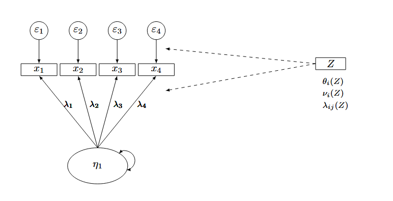

```{r setup, include=FALSE}
knitr::opts_chunk$set(echo = TRUE)
```

## General Information
### What is the title of the project?

SEMi-Complete by Design: A Monte Carlo simulation to assess Measurement Invariance in Moderated Nonlinear Factor Analysis and SEM-Trees.

### Who are the current and future project contributors?

Leonie Hagitte, Andreas M. Brandmaier

### Provide a description of the project.

Ensuring the validity of psychological assessments is crucial, yet differential item functioning (DIF) can threaten measurement invariance (MI) when test items function differently across groups [@Bauer2020]. Recent calls for improved DIF detection methods emphasize the need for more advanced statistical approaches [@Lee2024]. 
Moderated nonlinear factor analysis (MNLFA) is a recent approach for assessing MI via parameter moderation within a single-group confirmatory factor analysis framework. MLNFA evaluates MI across multiple continuous and categorical covariates, and accounts for heteroskedasticity by modeling factor and residual variances as functions of these covariates. While MNLFA offers continuous moderation of several parameters of SEMs (e.g.: factor loadings, covariances etc.), it requires a priori specification of covariates and their functional relationships [@Bauer2017; @Kolbe2024].
In contrast, structural equation modeling (SEM) trees and forests are data-driven, non-parametric methods that use recursive partitioning to identify latent subgroups in which model parameters differ, without assuming specific functional forms or predefined covariate effects. These approaches allow for nonlinear moderation of factor loadings and can reveal complex interaction effects, enabling the exploratory detection of DIF [@Brandmaier2016; @Brandmaier2013].
In this study, we conducted a Monte Carlo simulation to compare the performance of MNLFA and SEM trees and forests in detecting DIF and assessing MI under varying conditions. Specifically, we evaluate their effectiveness in identifying non-invariance and detecting relevant covariates. Our findings will inform best practices for selecting statistical techniques to test MI in psychological assessment.


### Did any of the contributors already conduct related simulation studies on this specific question?

Neither of the authors has conducted simulation studies that are of immediate relevance to the current project before. However, Andreas Brandmaier was involved in conducting simulation studies on SEM trees/ SEM forests as well as SEM modeling in general e.g.[@Buchberger2024; @SilvaDíaz2025; @Arnold2021]. 

## Aims
### What is the aim of the simulation study?

The aim of this simulation study is to evaluate different methods (i.e. MNLFA and SEM trees/ SEM forests) regarding their accuracy, power, and false-positive rate in detecting MI across different factor models (ADEMP category 'hypothesis testing'). 

## Data-Generating Mechanism
### How will the parameters for the data-generating mechanism (DGM) be specified?

The data will be generated parametrically.
Different population structural equation models (SEM) with latent variables and continuous indicators will be simulated in two different simulation studies: 


### Study 1
**Single-Factor Model with Moderated Parameters**

We specify a confirmatory factor analysis model (model 1) with a single latent factor $\eta$ and four observed indicators $\mathbf{x} = (x_1, \dots, x_4)^\top$. The influence of a continuous moderator is introduced into selected parameters via predefined transformation functions applied to an underlying raw moderator variable. The population model is:

$$
\mathbf{x} = \boldsymbol{\nu}(Z) + \boldsymbol{\Lambda}_x(Z)\,\eta + \boldsymbol{\varepsilon},
\qquad
\boldsymbol{\varepsilon} \sim \mathcal{N}(\mathbf{0}, \boldsymbol{\Theta}_\varepsilon).
$$

where

- $\boldsymbol{\nu}(Z)$ is the vector of intercepts,
- $\boldsymbol{\Lambda}_x(Z)$ is the $4 \times 1$ factor loading matrix,
- $\boldsymbol{\varepsilon} \sim \mathcal{N}\!\left(\mathbf{0}, \boldsymbol{\Theta}_\varepsilon\right)$ is the residual vector,
- $\eta \sim \mathcal{N}\!\left(\mu_\eta(Z), \sigma^2_\eta(Z)\right)$ is the latent factor,
- $Z = h(M)$ is the effective moderator entering the model equations, obtained by transforming a raw continuous covariate $M$.

#### Moderator Transformation

Let $M \sim \mathcal{U}(-1,1)$ denote a bounded continuous covariate.

The effective moderator is defined as
$$
Z = h(M),
$$

where $$h(\cdot)$$ is chosen from the following deterministic transformation functions.
Each transformation type is treated as a distinct condition in the simulation design:

1. **Linear:**
   $$
   h(M) = M
   $$
In this case, the effective moderator is bounded to the interval $(-1,1)$ and symmetric around zero.

2. **Sigmoid:**
   $$
   h(M) = a + \frac{b-a}{1 + \exp\!\bigl(-k(M-c)\bigr)},
   \qquad a=-1,\; b=1,\; c=0,\; k>0.
   $$
This transformation maps the input to the open interval $(-1, 1)$ and yields a bounded moderator symmetric around zero, exhibiting diminishing sensitivity at extreme values.

3. **Quadratic:**
   $$
   h(M) = 2M^2 - 1
   $$
This transformation captures symmetric nonlinear moderation as a function of distance from the center while remaining bounded in $(-1,1)$.

4. **Noise:**
   $$
   h(M) = 0
   $$
In this condition, the moderator has no effect on any model parameter and serves as a non-informative (noise) moderator.

Null moderation is represented by the noise-moderator condition $(Z=0)$, not by $\delta=0$; moderation coefficients are held fixed across conditions.
All parameter-level moderation effects are specified as linear functions of the effective moderator $Z$. Nonlinearity in moderation arises exclusively through the transformation $Z = h(M)$, not through nonlinear parameter functions.

%%%% Figure %%%%%%%

```{r}

```

#### Factor Loadings 

The baseline factor loadings were fixed to a discrete value of $\lambda_{xi} = 0.7$.  
Variation in loadings across simulation conditions arises exclusively through the presence or absence of moderation, which is treated as a fully crossed factor in the grid design.
  
**Moderated items:**  
  
At the population level, the baseline (unmoderated) measurement model is specified with a single latent factor and four indicators. 
The factor loading matrix is constructed such that all four indicators share a common loading value $\lambda$:

$$
\boldsymbol{\Lambda}_x =
\begin{bmatrix}
\lambda_1 \\
\lambda_2 \\
\lambda_3 \\
\lambda_4
\end{bmatrix}
$$
The latent factor variance is fixed at a prespecified constant value
$\psi_{\eta}= 1$ and is held constant across all simulation conditions.

For each condition involving moderation, the loading of item $i$ is defined as a deterministic function of the moderator $Z$:

$$
\lambda_{xi}(Z) = \lambda_{xi} + \delta_{\lambda} Z,
\quad Z \in [-1, 1].
$$

The parameter $\delta_{\lambda}$ represents the strength of the moderation effect and is specified using a discrete set of admissible values chosen to ensure that the moderated loading remains within a psychometrically plausible interval:

$$
\lambda_{xi}(Z) \in [0.3,\, 1.0].
$$

Given the fixed baseline loading $\lambda_{xi}=0.7$, this constraint yields an admissible range
$$
\delta_{\lambda} \in [-0.4,\, 0.3].
$$

$\delta_{\lambda}$ is evaluated at the following discrete levels:

$$
\delta_{\lambda} \in \{-0.4,\,-0.2,\,0.2,\,0.3\}.
$$

For moderator transformations beyond the linear case (quadratic or sigmoid), the functional form of $\lambda_{xi}(Z)$ is adapted accordingly, and the same discrete set of admissible moderation strengths is applied. 
This yields fully crossed combinations of (i) type of moderator transformation, (ii) number of moderated items, and (iii) moderation strength.

**Factor loading matrix:**

$$
\boldsymbol{\Lambda}_x(Z) =
\begin{bmatrix}
\lambda_1(Z) \\
\lambda_2(Z) \\
\lambda_3(Z)\\
\lambda_4(Z)
\end{bmatrix}
$$

Under partial moderation, only $\lambda_1(Z)$ and $\lambda_2(Z)$ depend on $Z$, while $\lambda_3(Z)=\lambda_3$ and $\lambda_4(Z)=\lambda_4$.
Under full moderation, all four loadings vary with $Z$.

- **Null Model:**
  Neither factor loadings, nor intercepts are moderated via Z. 
  There is no moderation present in this DGP.

- **Full moderation (Model 1.1):**
  All factor loadings and all intercepts vary with $Z$:
  $$
    \lambda_{xi}(Z) = \lambda_{xi} + \delta_{\lambda} Z, 
    \qquad
    \nu_{i}(Z) = \nu_{i} + \delta_{\nu} Z,
  $$
- **Partial moderation (Model 1.2):** 
- Only the loadings of items $1$ and $2$ and their intercepts can be moderated by Z:
  $$
    \lambda_{x1}(Z) = \lambda_{x1} + \delta_{\lambda} Z,
    \qquad
    \lambda_{x2}(Z) = \lambda_{x2} + \delta_{\lambda} Z,
  $$
  $$
    \nu_{x1}(Z) = \nu_{x1} + \delta_{\nu} Z,
    \nu_{x2}(Z) = \nu_{x2} + \delta_{\nu} Z,
  $$
whereas all remaining loadings and intercepts as well as residual variances $(\theta_{i0})$ remain fixed at their baseline values.

#### Residual Variances

Item reliabilities are varied deterministically across simulation conditions
using the fixed grid.
$$
Reliability_i \in \{0.60,\,0.70,\,0.80,\,0.95\}
$$

Baseline residual variances are derived analytically from a fixed latent variance
$\psi_\eta=\psi_0>0$ and indicator-specific reliability values:
$$
Reliability_i=\frac{\lambda_{xi}^2 \psi_0}{\lambda_{xi}^2 \psi_0 + \theta_{i0}}\quad \Rightarrow \quad\theta_{i0}=\frac{\lambda_{xi}^2 \psi_0(1-\text{Reliability}_i)}
     {\text{Reliability}_i}.
$$
#### Intercepts

Intercept moderation is manipulated via two fully crossed factors:  
(i) the pattern of moderated items and  
(ii) the magnitude of the moderation effect. For each indicator $i$, the intercept is modeled as
$$
\nu_i(Z) = \nu_i + \delta_{\nu} Z,
$$
where $\nu_i$ denotes the baseline intercept and $\delta_{\nu}$ controls the strength and direction of intercept moderation. The pattern of moderated items is varied across three levels:

- **No intercept moderation:** 
  $\delta_{\nu} = 0$ for all $i = 1,\dots,4$, such that
  $$
  \nu_i(Z) = \nu_i \quad \text{for all } i.
  $$

- **Partial intercept moderation (items 1 and 2):**  
    $$
    \delta_{\nu} \in \{-1.0,\,-0.5,\,0.5,\,1.0\} \quad \text{for } i \in \{1,2\},
    \qquad
    \delta_{\nu} = 0 \quad \text{for } i \in \{3,4\},
    $$
such that only $\nu_1(Z)$ and $\nu_2(Z)$ vary with $Z$.

- **Full intercept moderation (all items):**  
  $$
    \delta_{\nu} \in \{-1.0,\,-0.5,\,0.5,\,1.0\} \quad \text{for } i = 1,\dots,4,
  $$
such that the intercepts of all four indicators vary with $Z$.

Baseline intercepts are varied deterministically across simulation conditions using the fixed grid
  $$
\nu_i \in \mathcal{G}_\nu = \{-1,\, 0,\, 1\},
  $$
providing low, medium, and high intercept levels centered around zero. 
The simulation design thus yields fully crossed combinations of (a) intercept moderation pattern (none, partial, full), (b) moderation strength levels $\delta_{\nu}$, and (c) baseline intercept levels $\nu$.

#### Latent Distribution

Latent mean moderation was specified deterministically as:
$$
\mu_\eta(Z) = \alpha + \delta_\eta Z,
$$

with both parameters selected from discrete sets:  

$$
\alpha \in \{0\}, \qquad
\delta_\eta \in \{-1.0,\,-0.5,\,0.5,\,1.0\}.
$$

The latent variance was modeled to be fixed at 1.

\pagebreak

#### Analytical Model Study 1

```{r, echo=FALSE, fig.align="center", out.width="70%"}


```
  
The analytical model will also have one latent factor $\eta_1$. With four manifest indicators ${x_1,..., x_4}$, their factor loadings ${\lambda_1,..., \lambda_4}$ and their respective residuals ${\epsilon_1,..., \epsilon_4}$. In the analytical model the residuals will be assumed and modeled to be uncorrelated. Furthermore, the model includes a moderator variable $Z$, which can moderate the intercepts and factor loadings from none, one or two of the manifest variables. The moderator variable $Z$ will be modeled as linear or quadratic.


%%%%%%%%%%%%%%%%%%%%%%%%%%%%%%%%%%%%%%%%%%%%%%%%%%%%%%%%%%%%%%%%%%%%%%%%
### Study 2

**Two Factors with Moderator Effects**
We specify a confirmatory factor analysis model with two latent factors, $\eta_1$ and $\eta_2$, and seven observed indicators $\mathbf{x} = (x_1, \dots, x_4)^\top$ and $\mathbf{y} = (y_1, \dots, y_3)^\top$. 
Along their respective residuals ${\epsilon_1,...,\epsilon_4}$ and ${\delta_1,..., \delta_3}$. 
The first factor loads onto indicators $x_1$ to $x_4$, the second onto $y_1$ to $y_3$. 
A continuous moderator variable $Z$ introduces conditional heterogeneity into selected measurement parameters (i.e. intercepts, loadings and latent factor covariance) using one of three functional forms (linear, quadratic or sigmoid).

$$
\mathbf{x} = \boldsymbol{\nu}_x(Z) + \boldsymbol{\Lambda}_x(Z)\,\eta_1 + \boldsymbol{\varepsilon}(Z),
$$
$$
\mathbf{y} = \boldsymbol{\nu}_y(Z) + \boldsymbol{\Lambda}_y(Z)\,\eta_2 + \boldsymbol{\delta}(Z),
$$

where:

- $\boldsymbol{\nu}_x(Z)$ and $\boldsymbol{\nu}_y(Z)$ are the $4 \times 1$ and $3 \times 1$ vectors of intercepts for $\mathbf{x}$ and $\mathbf{y}$, respectively,
- $\boldsymbol{\Lambda}_x(Z)$ is the $4 \times 1$ loading vector for $\eta_1$, and $\boldsymbol{\Lambda}_y(Z)$ is the $3 \times 1$ loading vector for $\eta_2$,
- $\boldsymbol{\varepsilon}(Z) \sim \mathcal{N}\bigl(\mathbf{0}, \boldsymbol{\Theta}_x(Z)\bigr)$ and $\boldsymbol{\delta}(Z) \sim \mathcal{N}\bigl(\mathbf{0}, \boldsymbol{\Theta}_y(Z)\bigr)$ are the residual vectors for $\mathbf{x}$ and $\mathbf{y}$,
- $\boldsymbol{\eta} = (\eta_1, \eta_2)^\top \sim \mathcal{N}\bigl(\boldsymbol{\mu}_\eta(Z), \boldsymbol{\Phi}_\eta(Z)\bigr)$ is the latent factor vector,
- $Z = h(M)$ is the effective moderator entering the model equations, obtained by transforming a raw continuous covariate $M$.


#### Moderator Transformation

Let $M \sim \mathcal{U}(-1,1)$ denote a bounded continuous covariate.

The effective moderator is defined as
$$
Z = h(M),
$$

where $$h(\cdot)$$ is chosen from the following deterministic transformation functions.
Each transformation type is treated as a distinct condition in the simulation design:

1. **Linear:**
   $$
   h(M) = M
   $$
In this case, the effective moderator is bounded to the interval $(-1,1)$ and symmetric around zero.

2. **Sigmoid:**
   $$
   h(M) = a + \frac{b-a}{1 + \exp\!\bigl(-k(M-c)\bigr)},
   \qquad a=-1,\; b=1,\; c=0,\; k>0.
   $$
This transformation maps the input to the open interval $(-1, 1)$ and yields a bounded moderator symmetric around zero, exhibiting diminishing sensitivity at extreme values.

3. **Quadratic:**
   $$
   h(M) = 2M^2 - 1
   $$
This transformation captures symmetric nonlinear moderation as a function of distance from the center while remaining bounded in $(-1,1)$.

4. **Noise:**
   $$
   h(M) = 0
   $$
   
In this condition, the moderator has no effect on any model parameter and serves as a non-informative (noise) moderator.

Null moderation is represented by the noise-moderator condition $(Z=0)$, not by $\delta=0$; moderation coefficients are held fixed across conditions.
All parameter-level moderation effects are specified as linear functions of the effective moderator $Z$. Nonlinearity in moderation arises exclusively through the transformation $Z = h(M)$, not through nonlinear parameter functions.

#### Factor Loadings

For each latent factor, all baseline loadings for that factor are
fixed at 0.7. For the two-factor model in Study~2, this yields

$$
\boldsymbol{\Lambda}_x =
\begin{bmatrix}
0.7\\
0.7\\
0.7\\
0.7
\end{bmatrix},
\qquad
\boldsymbol{\Lambda}_y =
\begin{bmatrix}
0.7\\
0.7\\
0.7
\end{bmatrix},
$$

Moderation of factor loadings is introduced only for the first two $x$-indicators.
For each moderated indicator $i \in \{1,2\}$,
$$
\lambda_{xi}(Z) = \lambda_{xi} + \delta_{\lambda} Z .
$$

To ensure that moderated loadings remain within an admissible interval,
$$
\lambda_{xi}(Z) \in [0.3,\,1.0],
$$

the moderation coefficients are restricted to
$$
\delta_{\lambda} \in [-0.4,\,0.3],
$$

and evaluated on the discrete grid (leaving out the zero effect)
$$
\delta_{\lambda} \in \{-0.4,\,-0.2,\,0.2,\,0.3\}.
$$

Thus, the loading matrices take the form
$$
\boldsymbol{\Lambda}_x(Z)=
\begin{bmatrix}
\lambda_{x1}(Z)\\
\lambda_{x2}(Z)\\
0.7\\
0.7
\end{bmatrix},
\qquad
\boldsymbol{\Lambda}_y(Z)=
\begin{bmatrix}
0.7\\
0.7\\
0.7
\end{bmatrix},
$$

yielding fully crossed combinations of (i) moderator transformation type
$Z=h(M)$, (ii) moderated vs.\ unmoderated indicators, and
(iii) moderation strength $\delta_{\lambda}$.

#### Residual Variances


Item reliabilities are varied deterministically across simulation conditions
using the fixed grid.
$$
Reliability_i \in \{0.60,\,0.70,\,0.80,\,0.95\}
$$

Baseline residual variances are derived analytically from a fixed latent variance
$\psi_\eta=\psi_0>0$ and indicator-specific reliability values:

$$
Reliability_i=\frac{\lambda_{xi}^2 \psi_0}{\lambda_{xi}^2 \psi_0 + \theta_{i0}}\quad \Rightarrow \quad\theta_{i0}=\frac{\lambda_{xi}^2 \psi_0(1-\text{Reliability}_i)}
     {\text{Reliability}_i}.
$$
#### Latent Variable Distribution

Latent means are held constant at zero for both latent factors:

$$
\boldsymbol{\mu}_\eta(Z) = 
\begin{bmatrix}
0 \\[4pt]
0
\end{bmatrix}.
$$

Latent variances are allowed to vary with the effective moderator $Z$ through
the log-linear specification

$$
\sigma^2_{\eta_j}(Z)
  = \exp\!\left(\beta_{0j} + \beta_{1j} Z\right),
\qquad j = 1,2,
$$
ensuring positivity for all variance values.

The baseline variance is set to 1 and moderation strength is selected
from discrete grids:

$$
\delta_{\sigma_\eta} \in \{-0.4,\,-0.2,\,0.2,\,0.3\}.
$$

The latent covariance between $\eta_1$ and $\eta_2$ is fixed across all
conditions:

$$
\phi_{12}(Z) = 0.4,
$$

yielding the latent covariance matrix
$$
\boldsymbol{\Phi}_\eta(Z)
=
\begin{bmatrix}
\sigma^2_{\eta_1}(Z) & 0.4 \\
0.4 & \sigma^2_{\eta_2}(Z)
\end{bmatrix}.
$$

%%%%%%%%%%%%%%%%%%%%%%%%%%%%%%%%%%%%%%%%%%%%%%%%%%%%

{\small % reduce font size for figure caption only
\begin{sidewaysfigure}
\noindent{\textbf{Analytical Models Study 2}}
\centering

\begin{subfigure}[b]{0.47\textwidth}
    \centering
    \includegraphics[width=\linewidth]{tikz_model2.0.png}
    \caption{Model 2.0}
\end{subfigure}
\hspace{0.3cm} % tighter space
\begin{subfigure}[b]{0.47\textwidth}
    \centering
    \includegraphics[width=\linewidth]{tikz_model2.1.png}
    \caption{Model 2.1}
\end{subfigure}

\vspace{0.3cm} % reduced vertical space

\begin{subfigure}[b]{0.47\textwidth}
    \centering
    \includegraphics[width=\linewidth]{tikz_model2.2.png}
    \caption{Model 2.2}
\end{subfigure}
\hspace{0.3cm} % tighter space
\begin{subfigure}[b]{0.47\textwidth}
    \centering
    \includegraphics[width=\linewidth]{tikz_model2.3.png}
    \caption{Model 2.3}
\end{subfigure}

\caption{We specify a confirmatory factor analysis model with two latent factors, $\eta_1$ and $\xi_1$, and seven observed indicators, $\mathbf{x} = (x_1, \dots, x_4)^\top$ and $\mathbf{y} = (y_1, y_2, y_3)^\top$, along with their respective residuals, $\varepsilon_1, \dots, \varepsilon_4$ and $\delta_1, \delta_2, \delta_3$. The first factor, $\eta_1$, loads onto indicators $x_1$ to $x_4$, while the second factor, $\xi_1$, loads onto indicators $y_1$ to $y_3$. A continuous moderator variable $Z$ introduces conditional heterogeneity into selected measurement parameters, including residuals, intercepts, factor loadings, and latent factor covariance, using one of two functional forms (linear or quadratic). Red dashed arrows indicate model misspecifications.}
\end{sidewaysfigure}
}

\pagebreak

## What will be the different factors of the data-generating mechanism? 

The simulation design includes several manipulated factors that govern the data-generating mechanism (DGM). These factors are varied across simulation conditions and apply consistently to both studies, unless otherwise noted.

#### Core DGM Factors (Applied in Both Studies)

The following factors are systematically varied in both studies using a grid search design:

\begin{itemize}
    \item \textbf{Functional form of moderation:} The moderator variable \( Z \) is defined as a transformation of \( X \in [-1, 1] \), evaluated systematically using three functional forms:
    \begin{itemize}
        \item Linear: \( Z = X \)
        \item Quadratic: \( Z = X^2 \)
        \item Sigmoid: \( Z = \frac{1}{1 + \exp(-\delta(X - c))} \)
    \end{itemize}
    For the sigmoid function, parameters are fixed to:
    \[
    c = 0, \quad \delta \in \{5, 2.5, 1\}
    \]
    representing steep, moderate, and relatively flat sigmoid curves, respectively.
    
    \item \textbf{Moderated parameters:} The parameters subject to moderation by \( Z \) are systematically specified across grid conditions. For each condition, moderation is applied to:
    \begin{itemize}
        \item None
        \item One parameter (e.g., \(\lambda_{x1}\) or \(\nu_1\))
        \item Two parameters (e.g., \(\lambda_{x1}, \lambda_{x2}\))
    \end{itemize}
    This replaces random selection with explicit condition specification for clear, reproducible simulation configurations.

   \item \textbf{Latent variance moderation:} The latent variance is modeled as a log-linear function of \( Z \):  
    \[
    \sigma^2_\eta(Z) = \exp(\beta_0 + \beta_1 Z)
    \]
    where:
    \[
    \beta_0 \in \{-0.5, 0, 0.5\}, \quad \beta_1 \in \{-0.5, 0, 0.5\}
    \]
    \item \textbf{Model misspecification of moderator form:} The DGM defines \( Z \) using one of the three functional forms above, while the analytical model assumes either a \textit{linear} or \textit{quadratic} moderator effect.
\end{itemize}

#### Study-Specific Factors 

\paragraph{Study 1.} Focuses on functional form misspecification and data-related conditions:

\begin{itemize}
    \item \textbf{Analysis model:} Assumes either a linear or quadratic moderator.
    \item \textbf{Sample sizes:} \(N \in \{300, 500, 700, 1000\}\) 
    \item \textbf{Indicator reliabilities:} Low (.6), moderate (.7), moderate to high (.8), or high (.95).
    \item \textbf{No structural misspecification:} The factor structure and residual terms follow the specified model.
\end{itemize}

\paragraph{Study 2.} Builds on Study 1 and introduces additional model misspecification in the factor structure:

\begin{itemize}
    \item \textbf{Same DGM and moderator form variation as in Study 1.}
    \item \textbf{Analysis model:} Assumes either a linear or quadratic form for the moderator.
    \item \textbf{Structural model misspecifications:} (between-subjects factor)
    \begin{enumerate}
        \item \textbf{No misspecification:} Factor structure matches the analysis model.
        \item \textbf{Cross-loadings:} Items \( y_5 \), \( y_6 \) additionally load on a second latent factor:  
        \[
        \lambda^{(CL)}_5, \lambda^{(CL)}_6 \in \{0.3, 0.4\}
        \]
        \item \textbf{Correlated residuals:} Residual covariances are added between:  
        \[
        \text{Cov}(\varepsilon_1, \varepsilon_5),\quad \text{Cov}(\varepsilon_2, \varepsilon_6) \in \{0.2, 0.3\}
        \]

        \item \textbf{Combined:} Both cross-loadings and residual correlations are present.
    \end{enumerate}
\end{itemize}

### If there is more than one factor: How will the factor levels be combined and how many simulation conditions will this create? 

We employ a full grid search, in which parameter values are sampled from pre-specified discrete values. 
A total of 6000 simulation replications should ideally be conducted. This number was chosen to ensure that the confidence intervals for key estimated proportions (e.g., power or Type I error rates near \(p = 0.8\)) achieve an approximate width of \(\pm 1\%\). This is based on the calculation:
\[
\text{SE} = 2 \times \sqrt{\frac{p(1-p)}{6000}},
\]
which yields a standard error consistent with the desired precision for evaluating simulation outcomes within this study.
To ensure computational feasability, we propose an iterative approach whereby initial pilot simulations \(n=100\) are conducted to amongst others, estimate the needed simulation time. These estimates then inform a more principled determination of the total number of replications, targeting a predefined precision threshold.


The factors that vary across simulation conditions include:
\begin{itemize}
    \item The functional form of moderator effects (linear, quadratic, sigmoid)
    \item The type of moderated parameters (e.g., factor loadings, intercepts, residual variances)
    \item The degree of model misspecification (none, cross-loadings, correlated residuals, combined)
    \item Factor loadings (ranging from 0.7 to 0.9)
    \item Item reliabilities (ranging from 0.6 to 0.95)
    \item Moderator strength parameters 
    \item Sample sizes per group (i.e. 300, 500, 700, 1000)
\end{itemize}


## Estimands and Targets
### What will be the estimands and/or targets of the simulation study? 

The primary estimands in this simulation study pertain to the detection and accurate estimation of measurement non-invariance (MI) due to moderation effects on measurement parameters. Specifically, we assess whether the estimation methods compared can correctly identify the presence or absence of moderation in factor loadings, intercepts, and residual variances, reflecting the true data-generating structure. Consequently, key simulation outcomes include Type I error rates and statistical power associated with detecting such moderation effects, as well as bias and variability in the recovered parameter estimates.

Secondary estimands include model-level indicators of fit (e.g., RMSEA with confidence intervals, SRMR, CFI), which serve as auxiliary diagnostics for methods that yield such metrics (i.e., MNLFA). These are not applicable to tree-based approaches and are thus interpreted as method-specific targets rather than general evaluative criteria.

## Methods 
### How many and which methods will be included and which quantities will be extracted? 

We will compare the following methods:
    \begin{itemize}
    \item[1)] \textbf{MNLFA} (Moderated Nonlinear Factor Analysis): MNLFA was initially introduced by \textcite{Bauer2009} within the framework of integrative data analysis and was subsequently extended into a general approach for assessing measurement invariance and moderation \parencite{Bauer2017}. The fundamental principle of MNLFA is the parameterization of both measurement and structural model parameters as functions of one or more moderator variables. MNLFA accommodates both frequentist estimation methods, such as maximum likelihood (ML), and Bayesian techniques, including Markov Chain Monte Carlo (MCMC), thereby offering methodological flexibility aligned with specific analytical objectives \parencite{Muench2024}.

    \begin{verbatim}
        %code example?
    \end{verbatim}
        
    \item[2)] \textbf{SEM-Trees}: Structural equation modeling (SEM) trees were originally introduced by \textcite{Brandmaier2013} as a way to systematically search for important covariates and their interactions in data, creating homogeneous subgroups. The method was refined later on by \textcite{Brandmaier2016,Arnold2021}.  SEM trees and forests are data-driven, non-parametric methods that build upon the decision tree paradigm, thus using recursive partitioning to identify latent subgroups in which model parameters differ, without assuming specific functional forms or predefined covariate effects. These approaches allow for nonlinear moderation of factor loadings and can reveal complex interaction effects, enabling the exploratory detection of DIF.

    \begin{verbatim}
        %code example?
    \end{verbatim}

\end{itemize}

For the parametric MNLFA, we will extract estimated moderated parameters (e.g., factor loadings, intercepts, residual variances), their associated standard errors, and two-sided \textit{p}-values for testing the null hypothesis of no moderation effect. Additionally, model fit indices such as RMSEA (with confidence intervals), SRMR, and CFI will be recorded.\\
For the parameter estimates and fit indices, we will summarize their distributions across simulation replications by reporting key quantiles (2.5th, 50th, and 97.5th percentiles). The null hypothesis will be rejected if the associated \textit{p}-value is less than the conventional significance level of 0.05.
\\
In contrast, non-parametric Tree-based approaches do not yield direct parameter estimates with standard errors. There detection of MI/ non-invariance is operationalized via the presence of at least one split.
This distinction ensures that each method is evaluated according to its own inferential framework, while maintaining comparability in terms of its ability to detect MI reliably.


## Performance Measures 
### Which performance measures will be used?     

For the MNLFA \textbf{exclusively}, we will evaluate the following performance measures:

\begin{itemize}
    \item \textbf{Bias}: The average difference between the estimated parameter \(\hat{\theta}\) and the true parameter \(\theta\), defined as
    \[
    \widehat{\text{Bias}} = \frac{1}{n_{\text{sim}}} \sum_{i=1}^{n_{\text{sim}}} \hat{\theta}_i - \theta,
    \]
    where \(n_{\text{sim}}\) is the number of simulation replications.
    
    \item \textbf{Absolute Bias}:
    \[
    \widehat{\text{AbsBias}} = \frac{1}{n_{\text{sim}}} \sum_{i=1}^{n_{\text{sim}}} \left| \hat{\theta}_i - \theta \right|.
    \]
    
    \item \textbf{Relative Bias} (expressed as a proportion of the true parameter):
    \[
    \widehat{\text{RelBias}} = \frac{\widehat{\text{Bias}}}{|\theta|} \quad \text{for } \theta \neq 0.
    \]
    
    \item \textbf{Root Mean Squared Error (RMSE)}:
    \[
    \widehat{\text{RMSE}} = \sqrt{ \frac{1}{n_{\text{sim}}} \sum_{i=1}^{n_{\text{sim}}} (\hat{\theta}_i - \theta)^2 }.
    \]
    
    \item \textbf{Coverage Probability}: The proportion of confidence intervals that contain the true parameter \(\theta\).

    \item \textbf{Model Fit Indices} (e.g., RMSEA) will be reported if applicable, computed according to their standard definitions.
\end{itemize}
\vspace{\baselineskip}

For the SEM trees \textbf{as well as} for the MNLFA we will evaluate:
\vspace{\baselineskip}

\begin{itemize}

    \item \textbf{Type I Error Rate and Power}: The rejection rate of the null hypothesis at significance level \(\alpha = 0.05\), calculated as
    \[
    \widehat{\text{RRate}} = \frac{1}{n_{\text{sim}}} \sum_{i=1}^{n_{\text{sim}}} \mathbf{1}(p_i \leq 0.05),
    \]
    where \(\mathbf{1}(\cdot)\) is the indicator function.
    
\end{itemize}

Performance measures calculated for multiple parameters (e.g., factor loadings) will be aggregated by reporting the mean value across parameters. 


### How will Monte Carlo uncertainty of the estimated performance measures be calculated and reported? 
    
We will quantify Monte Carlo uncertainty using Monte Carlo Standard Errors (MCSEs) for each performance measure, calculated as follows:

\begin{itemize}
 \item The \textbf{Rejection Rate} refers to the proportion of simulated datasets in which a null hypothesis is rejected, commonly used to estimate empirical Type I error rates or statistical power.\\ The \textbf{MCSE for the Rejection Rate} is calculated assuming a binomial distribution of rejections across \(n_{\text{sim}}\) simulation replications, which reflects the standard error of a proportion estimator:

\[
\text{MCSE}_{\widehat{\text{RRate}}} = \sqrt{\frac{\widehat{\text{RRate}} (1 - \widehat{\text{RRate}})}{n_{\text{sim}}}},
\]

 \item For \textbf{Bias}, MCSE is calculated based on the sample variance of the specific parameter estimates across simulation replications:

\[
\text{MCSE}_{\widehat{\text{Bias}}} = \frac{S_{\hat{\theta}}}{\sqrt{n_{\text{sim}}}},
\]

 \item where $S_{\hat{\theta}} = \sqrt{\sum_{i=1}^{n_{\text{sim}}}{ \{\hat{\theta}_i - (\sum_{i=1}^{n_{\text{sim}}}\hat{\theta}_i/n_{\text{sim}})\}^2}/(n_{\text{sim}} - 1)}$ is the sample standard deviation of the effect estimates.
    \vspace{\baselineskip}

\end{itemize}
%siepe template as reference
%\textcite{Morris2019} and \textcite{Whitehead1993}.

\vspace{\baselineskip}

### How many simulation repetitions will be used for each condition?  

A total of 6000 simulation replications should ideally be conducted. This number was chosen to ensure that the confidence intervals for key estimated proportions (e.g., power or Type I error rates near \(p = 0.8\)) achieve an approximate width of \(\pm 1\%\). This is based on the calculation:
\[
\text{SE} = 2 \times \sqrt{\frac{p(1-p)}{6000}},
\]
which yields a standard error consistent with the desired precision for evaluating simulation outcomes within this study.
To ensure computational feasability, we propose an iterative approach whereby initial pilot simulations \(n=100\) are conducted to amongst others, estimate the needed simulation time. These estimates then inform a more principled determination of the total number of replications, targeting a predefined precision threshold.

### How will missing values due to non-convergence or other reasons be handled? 
    

Non-convergence or other missing values may occur during model estimation. We plan to:

\begin{itemize}
    \item Exclude only the specific simulation replicates that fail to converge for a given method while retaining data from other methods within the same replication.
    \item Report the proportion of non-converged cases per method and condition.
    \item If the proportion of non-convergence exceeds a pre-specified threshold (e.g., 5%), we will flag the corresponding simulation condition and interpret results with caution.
\end{itemize}

No imputation of missing estimates will be performed.


### How do you plan on interpreting the performance measures? 

\textit{Answer:}

## Other 
### Which statistical software/packages do you plan to use?    

\textit{Answer:}

### Which computational environment do you plan to use?  

\textit{Answer:}

### Which other steps will you undertake to make simulation results reproducible? 

\textit{Answer:}

### Is there anything else you want to preregister? 
    

\textit{Answer:}

\pagebreak
## References 
\nocite{Siepe2024}
\printbibliography[heading=none]
