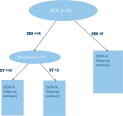
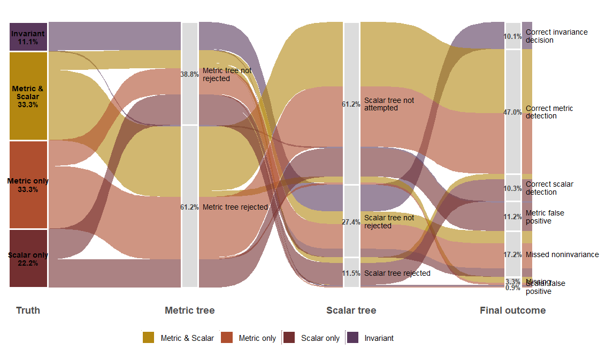
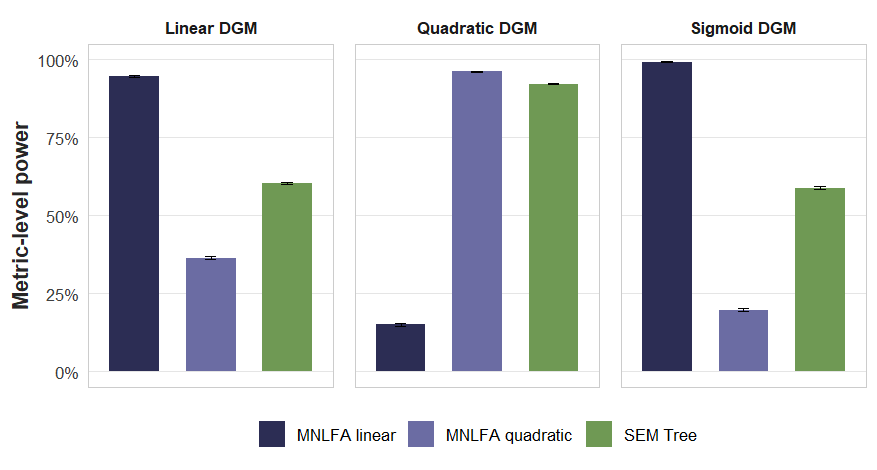
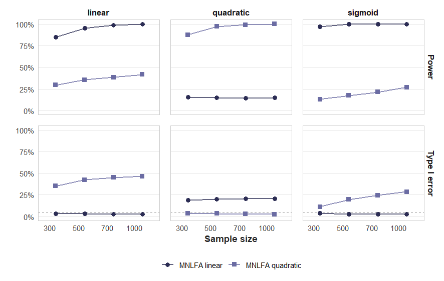
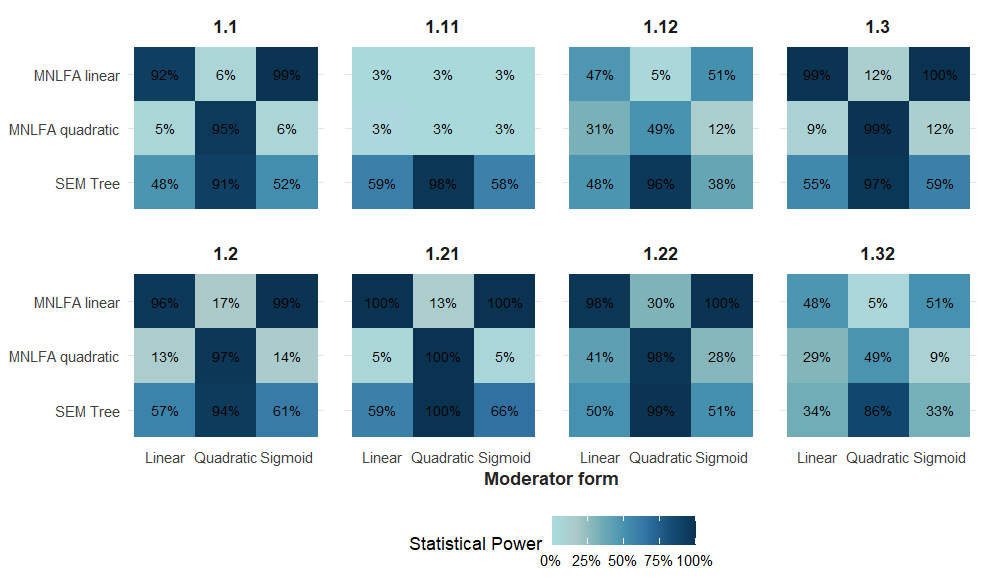

## 
\
\

::: {.highlight-box}
Do students with higher socioeconomic status report higher academic motivation?
:::

::: {.incremental .small .tight}
- Socioeconomic status (SES) is **continuous**.
- Measurement invariance (MI) is usually evaluated using **groups**.
- Researchers therefore create categories such as **low**, **medium**, and **high** SES.
- These categories are often **arbitrary**.
:::

::: {.fragment}
::: {.takeaway}
Can we evaluate MI without categorizing SES?
:::
:::

::: notes
Imagine we are interested in whether students with higher socioeconomic status report higher academic motivation. SES is naturally a continuous variable.

However, classical measurement invariance methods are based on comparing groups. Researchers therefore often create categories such as low, medium, and high SES.

The problem is that these categories are usually chosen by the researcher rather than implied by theory, and different cut-points can lead to different conclusions.

:::

------------------------------------------------------------------------

## When can we trust latent score differences?

::: {style="position:relative; height:650px; margin-top:0.5em; overflow:hidden;"}

{.fragment .current-visible data-fragment-index="1"
style="position:absolute; inset:0; width:100%; height:100%; object-fit:contain;"}

{.fragment .current-visible data-fragment-index="2"
style="position:absolute; inset:0; width:100%; height:100%; object-fit:contain;"}

{.fragment data-fragment-index="3"
style="position:absolute; inset:0; width:100%; height:100%; object-fit:contain;"}

:::

::: {.fragment .takeaway}
Latent score comparisons are only interpretable if the questionnaire functions equivalently across individuals.
:::

::: notes

- Two students: low SES vs. high SES.
- Both complete the same academic motivation questionnaire.
- Their responses are summarized as latent motivation scores.
- Click 1:
  - We would like to compare these latent scores.
- Click 2:
  - But this comparison is only meaningful if the questionnaire functions equivalently for both students.
- Click 3:
  - Otherwise, observed differences may reflect measurement bias rather than true differences in motivation.
- Key message:
  - Before interpreting latent score differences, measurement invariance must be established.
- Transition:
  - What does measurement invariance mean in practice?

:::

------------------------------------------------------------------------

## Why we test for Measurement Invariance?

::: {.lead}
Measurement invariance (MI) is a prerequisite for meaningful comparisons of latent constructs across groups [@Cheung2000; @Meredith1964].
:::

::: {.highlight-box}
Violations of MI imply that observed group differences may reflect **measurement artifacts** rather than substantive differences in the underlying constructs [@Putnick2016].
:::

::: {.takeaway}
Without MI, conclusions about group differences in means, variances, or relations are not statistically justified [@Putnick2016].
:::

::: notes

- Formal motivation for MI.
- Latent comparisons require measurement equivalence.
- Otherwise, differences may reflect measurement artifacts.
- Key message:
  - Measurement invariance is a prerequisite, not an optional assumption.
- Transition:
  - But how often is MI actually evaluated?

:::

------------------------------------------------------------------------

## Why we test for Measurement Invariance?

::: {.lead}
In empirical practice, MI is often assumed rather than systematically evaluated.
:::

::: {.columns}
::: {.column width="50%"}

::: {.design-card}
**Common practice**

- Measurement invariance is often **implicitly assumed** rather than empirically tested.
- The majority of psychological studies do **not test for MI** [@Maassen2025; @Rohrer2025].
:::

:::
::: {.column width="50%"}

::: {.design-card}
**Reporting quality**

- When MI is tested, reporting standards are often insufficient for replication [@Putnick2016; @Maassen2025].
- Fewer than 5% of comparison studies reported MI in a recent review [@Rohrer2025].
:::

:::
:::

::: {.highlight-box}
Recent re-analyses indicate that only **26%** of tested models achieved scalar invariance, while MI failed completely in **58%** of cases; in roughly **50%** of configural failures, the underlying factor structure differed between groups [@Maassen2025].
:::

::: {.takeaway}
The validity of many reported group comparisons therefore remains unclear.
:::

::: notes

- In practice, MI is often overlooked.
- Many psychological studies compare groups without testing MI.
- Even when MI is tested, reporting is frequently incomplete.
- Recent reviews show:
  - very few studies report MI,
  - scalar invariance is relatively uncommon,
  - factor structures often differ across groups.
- Key message:
  - The problem is not only methodological—it is also empirical.
- Transition:
  - How is MI traditionally evaluated?

:::

------------------------------------------------------------------------

## The Classical Measurement Invariance Approach 

::: {.lead}
Measurement invariance is traditionally evaluated by fitting the **same CFA model** simultaneously across predefined groups and testing equality constraints on model parameters [@Meredith1993; @Vandenberg2000; @Putnick2016].
:::

::: {.columns}

::: {.column width="50%"}

{width=95%}

:::

::: {.column width="50%"}

::: {.design-card}

**Typical grouping variables**

- Treatment vs. control
- Women vs. men
- Countries
- School types

:::

:::

::::

::: {.takeaway}
MGCFA assumes that individuals can be assigned to a finite set of **known groups**.
:::

::: notes

- Usually a CFA model is fitted simultaneously across multiple groups.
- Equality constraints are imposed and evaluated sequentially.
- Typical grouping variables are naturally categorical or treated as such:
  - treatment vs. control,
  - gender,
  - countries,
  - school types.
- Implicit assumption:
 - Implicitly, MGCFA approximates continuous parameter variation by a step function.
 - Within each group, parameters are assumed to be constant.
 - Parameter changes can only occur at the researcher-defined group boundaries.
 - This approximation may be reasonable—or may poorly represent the true moderation process.
- This effectively represents parameter variation as discrete group differences.
- Transition:
  - The next slides show how these equality constraints are evaluated.

:::

------------------------------------------------------------------------

## Sequential testing of measurement invariance

::: {.lead}
Measurement invariance is evaluated by progressively adding equality constraints across groups [@Meredith1993; @Cheung2002].
:::

:::: {.columns}

::: {.column width="38%"}

::: {.fragment .modelbox data-fragment-index="1"}
#### Configural
Same factor structure
:::

::: {.fragment .modelbox data-fragment-index="2"}
#### Metric
Equal factor loadings
:::

::: {.fragment .modelbox data-fragment-index="3"}
#### Scalar
Equal loadings + intercepts
:::

::: {.fragment .modelbox data-fragment-index="4"}
#### Strict
Equal loadings + intercepts + residual variances
:::

:::

::: {.column width="62%"}

::: {style="position:relative; height:500px; overflow:hidden;"}

{.fragment .current-visible data-fragment-index="1" style="position:absolute; inset:0; width:100%; height:100%; object-fit:contain;"}

{.fragment .current-visible data-fragment-index="2" style="position:absolute; inset:0; width:100%; height:100%; object-fit:contain;"}

{.fragment .current-visible data-fragment-index="3" style="position:absolute; inset:0; width:100%; height:100%; object-fit:contain;"}

{.fragment data-fragment-index="4" style="position:absolute; inset:0; width:100%; height:100%; object-fit:contain;"}

:::

:::

::::

::: {.fragment .takeaway data-fragment-index="5"}
Each step compares the current model to the previous, less constrained model.
:::

::: notes

- Configural:
  - Same construct across groups.
  - Basis for all subsequent invariance tests.

- Metric:
  - Same measurement unit (metric) across groups.
  - The latent construct has the same meaning.

- Scalar:
  - Same origin (zero point) of the latent scale.
  - Latent means can be compared.

- Strict:
  - Same residual variances (measurement precision).
  - Observed scores can be compared directly.
  - Rarely required in practice.

- Key point:
  - Each level builds on the previous one.

- Transition:
  - This framework assumes discrete, predefined groups.

:::

------------------------------------------------------------------------

## Limitations of the multigroup framework

::: {.lead}
MGCFA provides a well-established framework for testing measurement invariance, but its application to continuous moderators requires additional assumptions.
:::

:::: {.columns}

::: {.column width="50%"}

::: {.fragment .design-card}
### Continuous moderators 

- Socioeconomic status
- Age
- Symptom severity
- Personality traits

are inherently **continuous**.
:::

:::

::: {.column width="50%"}

::: {.fragment .design-card}
### Applying MGCFA requires

- defining discrete groups,
- assigning each individual to one group,
- assuming measurement parameters are constant **within** groups,
- estimating parameter differences only **between** groups.
:::

:::

::::

::: {.fragment .highlight-box}

Continuous moderators are therefore commonly categorized using **median splits, tertiles, quartiles**, or other arbitrary cut-points.

:::

::: {.fragment .takeaway}

Categorization approximates continuous parameter variation by a *step function*, potentially reducing statistical power and making conclusions dependent on arbitrary cut-points [@Bauer2017; @Curran2014].

:::

::: notes

- MGCFA is well suited for naturally categorical groups.
- Problems arise when the moderator is continuous.
- Or when one has to many groups.
- Researchers often categorize variables such as SES or age.
- This imposes researcher-defined cut-points.
- Continuous parameter variation is represented as a step function.
- Different cut-points may produce different conclusions.
- Categorization also discards information and may reduce statistical power.
- Transition:
  - MNLFA avoids this categorization by modeling parameters as functions of continuous moderators.

:::

------------------------------------------------------------------------

## MNLFA (Moderated Nonlinear Factor Analysis) 

::: {.lead}
Moderated Nonlinear Factor Analysis (MNLFA) extends traditional factor models by allowing measurement and latent-variable parameters to vary continuously as functions of observed covariates [@Kolbe2024; @Curran2014].
:::

::: {.highlight-box}
MNLFA represents model parameters as functions of observed covariates. Measurement noninvariance arises when measurement parameters vary across the moderator.
:::

::: {.columns}
::: {.column width="50%"}

**Parameters that may vary**  

- Factor loadings
- Item intercepts
- residual variances 
- Latent means and variances 

:::
::: {.column width="50%"}

**Moderators** 

- Continuous covariates
- Categorical covariates
- Examples: age, gender, SES

:::
:::

::: {.takeaway}
MNLFA models measurement noninvariance directly by allowing model parameters to vary continuously with observed moderators.
:::

::: notes

- MNLFA extends the CFA framework using definition variables.
- Rather than estimating separate group-specific parameters,
  parameters are modeled as functions of observed covariates.
- Measurement noninvariance is represented by moderation of e.g.
  factor loadings and/or item intercepts etc.
- The moderator may be continuous or categorical.
- Each individual therefore has parameter values conditional on
  their observed moderator value.
- No discretization of continuous moderators is required.

:::

------------------------------------------------------------------------

## MNLFA: Researcher Decisions 

::: {.columns}

::: {.column width="50%"}

::: {.design-card}

**Model specification**

- Which measurement parameters are moderated?
- Which moderators are included?
- Which functional form is specified
  (e.g., linear, quadratic)?

:::

:::

::: {.column width="50%"}

::: {.design-card}

**Method estimates**

- Moderated model parameters
- Continuous parameter functions
- Latent variable parameters

:::

:::

:::

::: {.takeaway}
MNLFA models measurement parameters as **parametric functions** of observed moderators. The quality of inference depends on appropriate model specification.
:::

::: notes

- MNLFA is also a confirmatory approach.
- The researcher needs to specify:
  - which parameters are moderated,
  - which moderators are included,
  - the functional form (e.g., linear or quadratic).
- The model estimates the corresponding moderation coefficients.
- Correct specification is important.
- If the assumed functional form is incorrect, inference may be affected.
- This question motivates my first simulation study.
- Transition:
  - SEM Trees approach the same problem differently.

:::

------------------------------------------------------------------------

## SEM Trees

::: {.lead}
Structural Equation Model (SEM) Trees combine confirmatory structural equation modeling with recursive partitioning to detect parameter heterogeneity across subgroups [@Brandmaier2013; @Brandmaier2016; @Arnold2021].
:::
::: {.columns}

::: {.column width="60%"}

{height=600px}

:::

::: {.column width="40%"}

::: {.design-card}

**How does it work?**

- Specify a measurement model.
- Trees test all given candidate covariates for parameter instability.
- Tree splits the sample at the most informative covariate and cut-point.
- Repeated recursively until no further significant splits are found.

:::
::: {.takeaway}
Rather than specifying **how** measurement parameters vary, SEM Trees discover subgroup structures directly from the data.
:::
:::

:::

::: notes

- SEM Trees combine CFA with recursive partitioning.
- Begin with a single CFA fitted to the entire sample.
- Score-based tests evaluate whether model parameters are stable with respect to each candidate covariate.
- Select the covariate and cut-point showing the strongest evidence of parameter instability.
- Split the sample and re-estimate the CFA within each resulting subgroup.
- Repeat recursively until no further significant parameter instability is detected.
- subgroup structure is discovered from the data.

:::
------------------------------------------------------------------------

## SEM Trees: Researcher Decisions

::: {.columns}

::: {.column width="50%"}

::: {.design-card}

**Researcher specifies**

- Measurement model
- Candidate covariates
- Tree complexity
  - significance level
  - minimum node size
  - stopping/pruning criterion
  
:::

:::

::: {.column width="50%"}

::: {.design-card}

**Method estimates**

- Split locations
- Relevant covariates
- Subgroup structure
- Parameter heterogeneity

:::

:::

:::

::: {.takeaway}

SEM Trees estimate measurement noninvariance **without requiring the researcher to specify a functional form of moderation**.

:::

::: notes

- SEM Trees only remain confirmatory with respect to the measurement model.
- generally speaking SEM trees are a data driven method.
- The researcher specifies:
  - the measurement model,
  - the candidate covariates,
  - and tree-complexity controls.
- The algorithm then determines:
  - whether parameter instability exists,
  - which covariate explains it best,
  - where the optimal split occurs,
  - and the resulting subgroup structure.
- Unlike MNLFA, no functional form of moderation is assumed.
- Moderation is inferred from the observed pattern of parameter instability.
- Transition:
  - The two methods therefore differ primarily in how they represent moderation.

:::

------------------------------------------------------------------------

## From Methods to Comparison 

::: {.lead}
Both methods evaluate measurement noninvariance for continuous moderators, but they rely on fundamentally different modeling strategies.
:::

| | **MNLFA** | **SEM Trees** |
|:---|:---|:---|
| **Measurement model** | User specified | User specified |
| **Representation of moderation** | Parametric function | Recursive partitioning |
| **Researcher specifies** | Functional form (e.g., linear, quadratic) | Tree complexity (e.g., stopping criterion) |
| **Method estimates** | Continuous parameter functions | Split locations and subgroup structure |
| **Most appropriate when** | Functional form is approximately known | Functional form is unknown or complex |

::: {.fragment}

::: {.takeaway}

The relative performance of both approaches depends on how well their modeling assumptions match the underlying process generating measurement noninvariance.

:::

:::

::: notes

- Both methods could address the same scientific question:
  - Does measurement noninvariance exist?
- MNLFA requires a few more researcher decisions.
- Whereas the decisions a researcher has to make with SEM trees are quite similar to the MGCFA approach
- The key difference is how moderation is represented.
- MNLFA:
  - parametric method
  - Researcher specifies the functional form.
- SEM Trees:
  - non-parametric method
  - Functional form is not specified.
  - The algorithm discovers subgroup structure from the data.

:::

------------------------------------------------------------------------

## 

 \
 \
 \
 
::: {.columns}
::: {.column width="30%"}
<br><br><br>

<div style="font-size:3em; font-weight:600;">
Questions?
</div>

<br>

:::
::: {.column width="70%"}
{fig-align="center" width=70%}
:::

:::

------------------------------------------------------------------------

## Choosing an Approach 

::: {.lead}
The appropriate method depends on how much is already known about the process generating measurement noninvariance.
:::

::: {.modelbox}

*Knowledge about the form of measurement noninvariance*

<div style="text-align:center;">

<br>

*Low*
<svg width="70%" height="18" style="vertical-align:middle;">
  <line x1="0" y1="9" x2="100%" y2="9" stroke="#777" stroke-width="2"/>
</svg>
*High*

<br>

<span style="margin-right:30%;">Exploratory</span>
<span style="margin-left:30%;">Confirmatory</span>

<br>

<span style="margin-right:18%;"><strong>SEM Trees</strong></span>
<span style="margin-left:18%;"><strong>MNLFA</strong></span>

</div>
:::

::: {.fragment .takeaway}
**When does each approach provide the greatest advantage?**

The following simulation study addresses this question.
:::

::: notes
- we argue that the choice of method should depend on the amount of prior knowledge about the    moderation process/ theoretical foundation.
- Their performance depends on how well their assumptions match the data-generating process.
- Transition:
  - This motivates the simulation study.
:::

------------------------------------------------------------------------

## Study 1: Data-Generating Process

::: {.lead}
Study 1 investigates how functional-form misspecification affects the detection of measurement noninvariance by MNLFA and SEM Trees.
:::

::: {.columns}

::: {.column width="50%"}

::: {.design-card}

**Population models**

- Single-factor CFA
- Four observed indicators
- One continuous moderator (mostly)
- Moderated loadings and/or intercepts

:::

::: {style="position:relative; height:300px; margin-top:0.5em; overflow:hidden;"}

{.fragment .current-visible data-fragment-index="1" style="position:absolute; inset:0; width:100%; height:95%; object-fit:contain;"}

{.fragment .current-visible data-fragment-index="2" style="position:absolute; inset:0; width:100%; height:95%; object-fit:contain;"}

{.fragment .current-visible data-fragment-index="3" style="position:absolute; inset:0; width:100%; height:95%; object-fit:contain;"}

{.fragment .current-visible data-fragment-index="4" style="position:absolute; inset:0; width:100%; height:95%; object-fit:contain;"}

{.fragment .current-visible data-fragment-index="5" style="position:absolute; inset:0; width:100%; height:95%; object-fit:contain;"}

{.fragment .current-visible data-fragment-index="6" style="position:absolute; inset:0; width:100%; height:95%; object-fit:contain;"}

{.fragment .current-visible data-fragment-index="7" style="position:absolute; inset:0; width:100%; height:95%; object-fit:contain;"}

{.fragment data-fragment-index="8" style="position:absolute; inset:0; width:100%; height:95%; object-fit:contain;"}

:::

:::

::: {.column width="50%"}

::: {.design-card}

**Experimental manipulation**

- Functional form of moderation
- Magnitude of moderation
- Sample size
- Indicator reliability

:::
 
```{r}
#| eval: false
#| echo: true
#| code-line-numbers: "1|3-13"

MOD_TYPES <- c("linear","sigmoid","quadratic","noise")

DESIGN <- tidyr::expand_grid(
  popmodel     = c("0","1.1","1.11","1.12","1.2","1.21","1.22","1.3","1.32"),
  N            = c(300, 500, 700, 1000),
  reliability  = c(0.60, 0.75, 0.95),
  lambda       = 0.70,
  intercepts   = 1,
  delta_lambda = c(0.2, 0.3),
  delta_nu     = c(0.5, 1),
  moderator    = MOD_TYPES,
  analysis_form = c("linear", "quadratic"),
  rep_id = 1:n_rep
)
```

:::

:::

::: notes
- Each design cell was replicated $n_{\mathrm{rep}}$ times.
- The simulation comprised 3,456 unique design cells.
- Each design cell was submitted as an independent SLURM job.
- Independent random seeds ensured reproducibility.
- Output files were combined for the final analyses.

:::

------------------------------------------------------------------------

## Study 1: Moderator Functions

::: {.lead}
Moderation was introduced by transforming a continuous moderator $M \sim \mathcal{U}(-1,1)$ before it entered the data-generating model.
:::

::: {.columns}

::: {.column width="68%"}

```{r}
#| echo: false
#| warning: false
#| message: false
#| fig-align: center
#| out-width: "100%"

library(ggplot2)
library(dplyr)
library(tidyr)

M <- seq(-1, 1, length.out = 500)
k <- 10

df_h <- tibble(
  M = M,
  Linear = M,
  Quadratic = 2 * M^2 - 1,
  Sigmoid = -1 + 2 / (1 + exp(-k * M)),
  Noise = 0
) |>
  pivot_longer(
    cols = -M,
    names_to = "Function",
    values_to = "hM"
  )

ggplot(df_h, aes(x = M, y = hM, color = Function, linetype = Function)) +
  geom_line(linewidth = 1) +
  labs(
    x = "Moderator M",
    y = "h(M)",
    color = "Function",
    linetype = NULL
  ) +
  theme_minimal(base_size = 16) +
  theme(
    legend.position = "none",
    panel.grid.minor = element_blank()
  )
```
:::

::: {.column width="32%"}

::: {.design-card style="font-size:0.82em;"}

**Functions**

| Form | $h(M)$ |
|:---|:---|
| Linear | $M$ |
| Quadratic | $2M^2 - 1$ |
| Sigmoid | $-1 + \frac{2}{1+\exp(-10M)}$ |
| Noise | $0$ |

:::

:::

:::

::: {.takeaway}
The data-generating process varied the true functional form of parameter moderation; the analysis model may or may not match this form.
:::

------------------------------------------------------------------------

## Study 1: Analytical Models 

::: {.lead}
The analysis models differed in the assumptions they required about the location and form of measurement noninvariance.
:::

::: {.columns}

::: {.column width="50%"}

::: {.design-card}

**MNLFA**

**Specified in the analysis model**

- Functional form:
  - linear or quadratic
- Defined moderators:
  - $a m_1$, $a m_2$, $a m_{12}$
- All item-level moderation paths estimated

**Potential mismatch**

- True moderation may be linear, quadratic, sigmoid, or absent
- True noninvariance may affect only a subset of indicators
- The analysis model may therefore be under- or over-specified

:::

:::

::: {.column width="50%"}

::: {.design-card}

**SEM Trees**

**Specified in the analysis model**

- Measurement model
- Candidate moderators:
  - $a m_1$, $a m_2$, $m_0$
- Tree-complexity controls:
  - $\alpha = .05$
  - Bonferroni correction
  - minimum node size

**Potential trade-off**

- No parametric functional form is imposed
- The algorithm must select the relevant moderator
- Power depends on detecting split-based parameter instability

:::

:::

:::

::: {.takeaway}
Study 1 therefore compares **parametric specification uncertainty** in MNLFA with **data-driven moderator selection** in SEM Trees.
:::

------------------------------------------------------------------------

## Study 1: Evaluation Criteria 

::: {.lead}
Method performance was evaluated with respect to detecting and correctly attributing measurement noninvariance.
:::

::: {.columns}

::: {.column width="50%"}

::: {.design-card}
**MNLFA**

**Detection accuracy**

- Type I error
- Statistical power

**Localization**

- Detection at the metric stage
- Detection at the scalar stage

**Estimation**

- Successful model estimation
- Moderation-effect estimates
:::

:::

::: {.column width="50%"}

::: {.design-card}
**SEM Trees**

**Detection accuracy**

- Type I error
- Statistical power

**Localization**

- Selection of correct moderator
- Selection of incorrect moderator
- Splitting on correct focus parameters 

**Tree structure**

- Number of detected splits
- Successful tree estimation
:::

:::

:::

::: {.takeaway}
Both methods were primarily compared using **Type I error** and **statistical power**; secondary criteria evaluated where and how noninvariance was identified.
:::

------------------------------------------------------------------------

## Preliminary Results

::: {.lead}

:::

{.lightbox fig-align="center" width="100%"}

::: notes
- refers to heterogeneity/ noninvariance 
- only for trees.

:::

------------------------------------------------------------------------

## Preliminary Results 

::: {.lead}
Metric-level statistical power depends strongly on the agreement between the true and assumed form of moderation.
:::

{.lightbox fig-align="center" width="85%"}


::: notes

- MNLFA achieves the highest power when the analytical model matches the true moderation function.
- Misspecification reduces the performance of parametric models.
- SEM Trees provide comparatively stable performance across different moderation functions.

:::

------------------------------------------------------------------------

## Preliminary Results 

::: {.lead}
The influence of functional-form specification persists across sample sizes while maintaining acceptable Type I error rates.
:::

{.lightbox fig-align="center" width="92%"}

::: notes
Thus, a replication is counted as a success whenever the Bonferroni-adjusted likelihood-ratio test rejects metric invariance, regardless of whether the assumed moderation function (linear or quadratic) matches the true function.

For MNLFA:
Power=P(Reject MI∣MI violated)

For SEM Trees:
P(Reject MI AND identify the correct moderator∣MI violated)

- Statistical power increases with sample size for both methods.
- Type I error remains close to the nominal level across moderator conditions.
- Functional-form misspecification continues to reduce MNLFA power even as sample size increases.
-Therefore the upper panels show 
  - P(Reject invariance∣true metric noninvariance)
-The lower panels show
  - P(Reject invariance∣metric invariance holds)
  
Empirical detection rates for metric measurement noninvariance across moderator functions, effect sizes, and sample sizes. For MNLFA, detection was defined as rejection of the Bonferroni-adjusted likelihood-ratio test for metric invariance. Consequently, successful detection does not require recovery of the true moderation function; linear and quadratic MNLFA models are credited whenever they detect measurement noninvariance, even if the assumed functional form is misspecified. For SEM Trees, successful detection additionally required that the first split occurred on the true moderating variable, reflecting correct identification of the source of parameter instability.
  
:::


------------------------------------------------------------------------ 

## Preliminary Results 

::: {.lead}
The observed performance patterns are consistent across the different population-model conditions included in Study 1.
:::

{.lightbox fig-align="center" width="92%"}

::: notes

- The relative ordering of the methods remains largely consistent across population models.
- Performance differences are driven primarily by the functional form of moderation rather than by the specific location of measurement noninvariance.
- No single population model dominates the overall findings.

:::


------------------------------------------------------------------------

## What is Done, What is to be Done?

- This study was preregistered at Zenodo: https://doi.org/10.5281/zenodo.19891930
- Following the ADEMP preregistration approach [@Siepe2024]
- Study 2 is still missing
- parameter estimation for MNLFA is missing
- partial dependence plots as well


------------------------------------------------------------------------

## Questions & Concerns 

\

::: {.columns}
::: {.column width="60%"}
-   How do I ensure that the comparison is fair? 
-   Why don't I see mean changes with sample size or reliability? 
-   How do you see the sequential results? 
-   Did I forget something in the simulation set-up?
:::
::: {.column width="40%"}

:::
:::

## References
