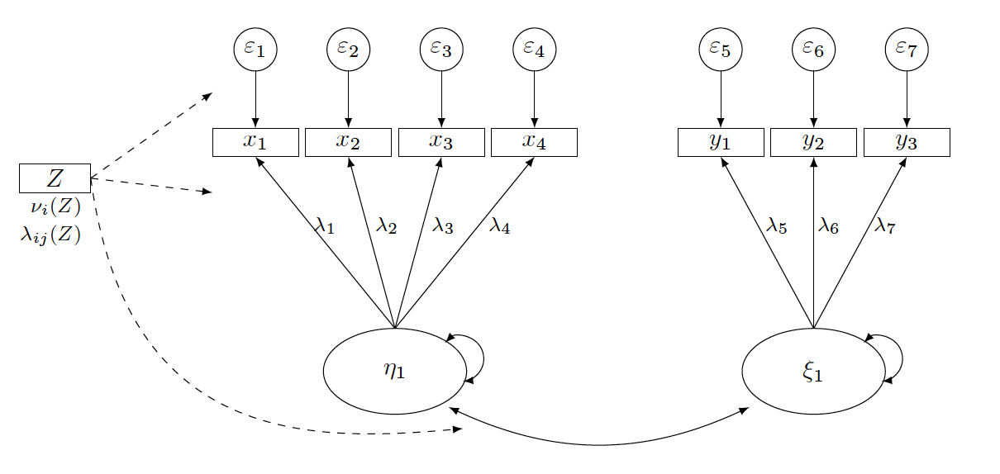
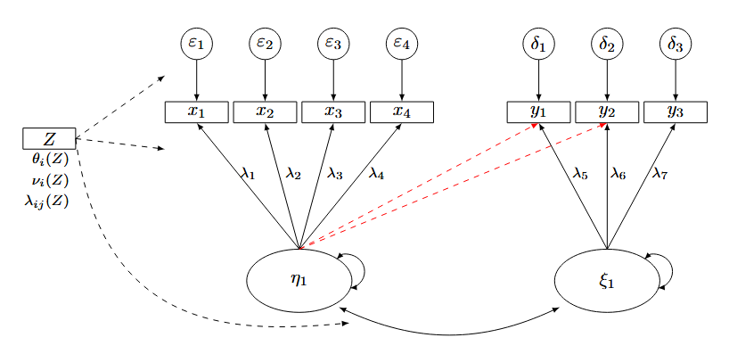
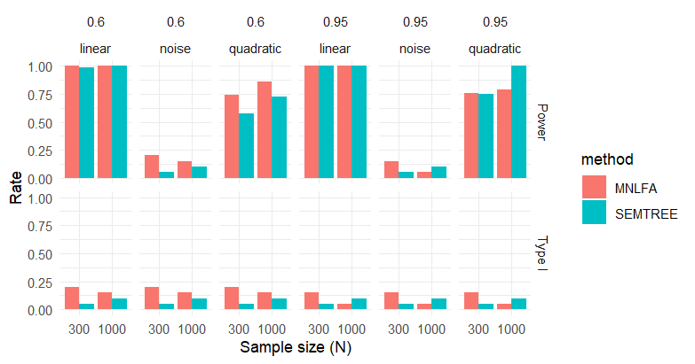
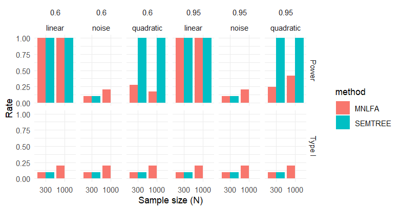

## Why Care About Measurement Invariance?

Measurement invariance (MI) is a prerequisite for meaningful comparisons of latent constructs across groups [@Cheung2000; @Meredith1964].\
Violations of MI imply that observed group differences may reflect **measurement artifacts** rather than substantive differences in the underlying constructs[@Putnick2016].

::: {.incremental}
-   Without MI, conclusions about group differences in means, variances, or relations are not statistically justified[@Putnick2016].
:::

------------------------------------------------------------------------

## Why Care About Measurement Invariance?

-   Measurement invariance is often **implicitly assumed** rather than empirically tested\
-   The majority of psychological studies do **not test for MI** [@Maassen2025; @Rohrer2025]\
-   When MI is tested, reporting standards are frequently insufficient for replication [@Putnick2016; @Maassen2025]
-   @Rohrer2025 also note that only <5% of comparison studies reported MI in a recent review.

:::{.incremental}
-   As a result, the validity of many reported group comparisons remains unclear.
:::

<!--
------------------------------------------------------------------------

## Empirical Evidence on MI Violations

Recent literature reviews highlight the severity of the problem:

:::{.incremental}
-   > *“None of the reported MI tests were reproducible, and only 26% of the 174 newly performed MI tests reached sufficient (scalar) invariance, with MI failing completely in 58% of tests.”*[@Maassen2025]

-   Additionally, in approximately **50% of cases** where configural invariance was rejected, the **number of latent factors differed between groups**, indicating fundamentally different measurement structures [@Maassen2025].
:::
------------------------------------------------------------------------
-->

## SEM Trees

Structural Equation Model (SEM) Trees integrate **confirmatory SEM** with **recursive partitioning** [@Brandmaier2013; @Brandmaier2016; @Arnold2021].

Key characteristics:

-   Automatically detect **heterogeneity in model parameters**\
-   Identify **subgroups** in which measurement or structural parameters differ\
-   Allow data-driven detection of **non-invariance**

SEM Trees are particularly useful when grouping variables are unknown or continuous and if you have plenty.

------------------------------------------------------------------------

## Advantages and Limitations of SEM Trees

**Strengths** 
 
:::{.incremental}
-   Flexible, exploratory identification of non-invariance\
-   Can handle complex interaction structures\
-   Transparent subgroup definitions\
-   Should perform well with sigmoid effects
:::

**Limitations** 

:::{.incremental}
-   Risk of overfitting without cross-validation\
-   Results depend on splitting criteria\
-   Less suitable for strict confirmatory hypothesis testing\
-   The functional form could be harder to retrieve
:::
------------------------------------------------------------------------

## MNLFA (Moderated Nonlinear Factor Analysis)

Moderated Nonlinear Factor Analysis (MNLFA) extends traditional factor models by allowing:

:::{.incremental}
-   Item parameters (loadings, intercepts)\
-   Factor means and variances
:::

to vary **continuously** as functions of observed covariates (e.g., age, gender, SES) [@Kolbe2024;@Curran2014]. 
This means MI is conceptualized as the **moderation** of certain parameters by a external variable.

This therefore directly models measurement non-invariance instead of testing it sequentially [@Kolbe2021; @Curran2014].

------------------------------------------------------------------------

## Advantages and Limitations of MNLFA

**Strengths** 

:::{.incremental}
-   Handles both categorical and continuous moderators\
-   Avoids arbitrary group discretization\
-   Provides fine-grained modeling of parameter variation\
-   Is suited for nonlinear relationships
::: 

**Limitations** 

:::{.incremental}
-   High model complexity\
-   Strong distributional and functional form assumptions\
-   Requires large sample sizes and careful model specification\
::: 

MNLFA is most appropriate when **theory** suggests **systematic moderation** of measurement parameters.

<!---
------------------------------------------------------------------------

## Exploratory vs. Confirmatory Approaches

So the question arises when to use which method for MI testing? 

:::{.incremental}
-   I would argue that this is a question of the substantive nature of your research question\
-   MI testing should be pursued with rigor and diligent documentation\
-   However it is not necessarily always a prerequisite to have **Residual Invariance** established\
-   So how far you are progessed in a theoretical foundation is key\
-   And what question you want to answer also determines the required invariance level\
:::
------------------------------------------------------------------------
-->

## Simulation

Monte Carlo simulation to compare SEM trees and MNLFA  

-   I am about to preregister the simulation, using the template from @Siepe2024. 
-   Data will be generated parametrically
-   Different population models
    -   Single-Factor cfa model with four manifest indicators
$$
\mathbf{x} = \boldsymbol{\nu}(Z) + \boldsymbol{\Lambda}_x(Z)\,\eta + \boldsymbol{\varepsilon},
\qquad
\boldsymbol{\varepsilon} \sim \mathcal{N}(\mathbf{0}, \boldsymbol{\Theta}_\varepsilon).
$$  
    -   Two-Factor cfa model with four manifest indicators
$$
\mathbf{x} = \boldsymbol{\nu}_x(Z) + \boldsymbol{\Lambda}_x(Z)\,\eta_1 + \boldsymbol{\varepsilon}(Z),
$$
$$
\mathbf{y} = \boldsymbol{\nu}_y(Z) + \boldsymbol{\Lambda}_y(Z)\,\eta_2 + \boldsymbol{\delta}(Z),
$$

## Simulation

Let $M \sim \mathcal{U}(-1,1)$ denote a bounded continuous covariate.

**Moderation is introduced via transformations of $M$:**

- Linear:
$$
  h_1(M) = M
$$

- Quadratic:
$$
  h_2(M) = 2M^2 - 1
$$

- Sigmoid:
$$
  h_3(M) = a + \frac{b-a}{1 + \exp\!\bigl(-k(M-c)\bigr)}
$$
- Noise:
No systematic relationship with parameters

These transformed variables enter the model as **separate moderators**, allowing for flexible functional forms of parameter variation.

## Simulation 
**Analytical Model Study 1**

{.lightbox}

<!--
## Simulation  

**Analytical Model Study 2**

::: {.columns}
::: {.column width="50%"}
{.lightbox}
*Model 2.0*
:::
::: {.column width="50%"}
{.lightbox}
*Model 2.1*
:::
:::

::: {.columns}
::: {.column width="50%"}
{.lightbox}
*Model 2.2*
:::
::: {.column width="50%"}
{.lightbox}
*Model 2.3*
:::
:::

-->

## Study-Specific Factors

**Study 1: Functional-Form and Measurement-Parameter Misspecification**

Focuses on moderator-form misspecification and data-related conditions, without structural misspecification.

- **Data-generating moderator form:** linear, sigmoid, quadratic, or noise
- **MNLFA analysis model:** linear moderation
- **SEMTREE analysis model:** recursive partitioning
- **Population models:** $0, 1.1, 1.11, 1.12, 1.2, 1.21, 1.22, 1.3$
- **Sample size:** $N \in \{300, 500, 700, 1000\}$
- **Indicator reliability:** $.60, .70, .80, .95$
- **Loading moderation:** $\Delta_\lambda \in \{-0.3,-0.2,0.2,0.3\}$
- **Intercept moderation:** $\Delta_\nu \in \{-1,-0.5,0.5,1\}$
- **No structural misspecification:** factor structure and residual specification match the generating model

<!--
## Study-Specific Factors 

**Study 2: Structural Misspecification**

Extends Study 1 by introducing factor-structure misspecification: 

*Same DGM and moderator variation, sample size and reliability as Study 1*

- **Analysis model:** Linear or quadratic moderator
- **Structural misspecification (between-subjects):**

  1. **None:** Correct factor structure  
  2. **Cross-loadings:**  
     Items $y_5$, $y_6$ load on a second factor
     $$
     \lambda^{(CL)}_5,\; \lambda^{(CL)}_6 \in \{0.3, 0.4\}
     $$
  3. **Correlated residuals:**  
     $$
     \text{Cov}(\varepsilon_1, \varepsilon_5),\;
     \text{Cov}(\varepsilon_2, \varepsilon_6)
     \in \{0.2, 0.3\}
     $$
  4. **Combined:** Cross-loadings and residual correlations
-->

## Trial Run: Data-Generating Model

::: {.columns}
::: {.column width="50%"}

**Measurement model**  
Single-factor CFA with one latent factor $\eta$ and four indicators $y_1$–$y_4$:
$$
\mathbf{y} = \boldsymbol{\nu}(Z) + \boldsymbol{\Lambda}_y(Z)\,\eta + \boldsymbol{\varepsilon}(Z)
$$
**Moderation structure**

Multiple observed moderators are included:

- $m_1$: primary moderator  
- $m_2$: secondary moderator  
- $m_0$: noise covariate  

Functional forms:
- Linear: $h(m)=m$  
- Quadratic: $h(m)=2m^2-1$  
- Noise (null condition)

:::
::: {.column width="50%"}

**Baseline parameters**

- Factor loadings: $\lambda = 0.70$  
- Indicator reliability: $0.60,\;0.95$

**Population model**

- **NULL (0):** No moderation  
- **1.22:** Partial metric *and* scalar noninvariance  
  - Loadings $x_1, x_2$ moderated  
  - Intercepts $x_1, x_2$ moderated  

**Effect sizes**

- $\Delta_\lambda \in \{-0.3, 0.3\}$  
- $\Delta_\nu \in \{-1, 1\}$  

**Design factors (trial run)**

- Sample size: $N \in \{300,\;1000\}$  
- Replications: pilot (e.g., 5–15 seeds per condition) 

:::
:::

## Trial Run: Analytical Models

::: {.columns}
::: {.column width="50%"}

### SEM Trees (nonparametric detection)

**Baseline model**
- Single-factor CFA (RAM specification)

**Predictors**
- $m_1$, $m_2$, $m_0$

**Procedure**
- Score-based recursive partitioning  
- Bonferroni-corrected split tests  
- Pre-pruning:
  - $\alpha = .05$
  - max depth = 3
  - minimum node size = 50

**Evaluation**

- Global tree test (significance)  
- Root split detection (which variable)  
- Type I error: splits under NULL  
- Power: splits under true moderation  

:::
::: {.column width="50%"}

### MNLFA (parametric detection)

**Model specification (OpenMx)**

Moderation modeled linearly via definition variables:

- Loadings: $\Lambda(Z)$  
- Intercepts: $\nu(Z)$  

**Sequential testing strategy**

1. Configural model  
2. Metric model (no loading moderation)  
3. Scalar model (no loading + intercept moderation)  

**Decision criteria**

- Likelihood-ratio tests (LRT)  
- $\Delta$CFI, $\Delta$RMSEA  

**Key assumption**

- Moderation is **linear** in the analysis model  

:::
:::
<!--
## Trial Run: What Is Being Tested? 

This pilot simulation focuses on **functional-form misspecification**:

::: {.incremental}
- Data-generating process may be **nonlinear** (quadratic)
- MNLFA assumes **linear moderation**
- SEM Trees make **no functional-form assumptions**
:::

**Key comparison**

- **MNLFA**: efficient under correct specification  
- **SEMTREE**: flexible under misspecification  

**Expected pattern**

- Linear moderation → MNLFA advantage  
- Nonlinear moderation → SEMTREE advantage  
- Noise → Type I error control
-->

## Preliminary Results 

**Overall Results**

| Level  | Method   | Type   | Value |
|--------|----------|--------|-------|
| Metric | MNLFA    | Power  | 0.619 |
| Metric | MNLFA    | Type I | 0.138 |
| Metric | SEMTREE  | Power  | 0.611 |
| Metric | SEMTREE  | Type I | 0.075 |
| Scalar | MNLFA    | Power  | 0.459 |
| Scalar | MNLFA    | Type I | 0.150 |
| Scalar | SEMTREE  | Power  | 0.683 |
| Scalar | SEMTREE  | Type I | 0.050 |

## Preliminary Results 

::: {.columns}
::: {.column width="50%"}
{.lightbox}
*Metric Level MI Testing*
:::
::: {.column width="50%"}
{.lightbox}
*Scalar Level MI Testing*
:::
:::

## Questions & Concerns 

\

::: {.columns}
::: {.column width="60%"}
-   How do I ensure that the comparison is fair, the best?
-   What Prepruning to use for enhancing power of the trees?
-   What alternetive can i use other than significance testing for model fit evaluation?
-   Did I forget something in the simulation set-up?
:::
::: {.column width="40%"}

:::
:::

## Preliminary Results 

**Type I Error and Power Metric Stage**

| N    | Reliability | Moderator  | MNLFA Type I | MNLFA Power | SEMTREE Type I | SEMTREE Power |
|------|------------|-----------|-------------|-------------|----------------|---------------|
| 300  | 0.60       | linear    | 0.200       | 1.000       | 0.050          | 0.988         |
| 300  | 0.60       | noise     | 0.200       | 0.200       | 0.050          | 0.050         |
| 300  | 0.60       | quadratic | 0.200       | 0.740       | 0.050          | 0.575         |
| 300  | 0.95       | linear    | 0.150       | 1.000       | 0.050          | 1.000         |
| 300  | 0.95       | noise     | 0.150       | 0.150       | 0.050          | 0.050         |
| 300  | 0.95       | quadratic | 0.150       | 0.755       | 0.050          | 0.750         |
| 1000 | 0.60       | linear    | 0.150       | 1.000       | 0.100          | 1.000         |
| 1000 | 0.60       | noise     | 0.150       | 0.150       | 0.100          | 0.100         |
| 1000 | 0.60       | quadratic | 0.150       | 0.862       | 0.100          | 0.725         |
| 1000 | 0.95       | linear    | 0.050       | 1.000       | 0.100          | 1.000         |
| 1000 | 0.95       | noise     | 0.050       | 0.050       | 0.100          | 0.100         |
| 1000 | 0.95       | quadratic | 0.050       | 0.792       | 0.100          | 1.000         |

## Preliminary Results 

**Type I Error and Power Scalar Stage**

| N    | Reliability | Moderator  | MNLFA Type I | MNLFA Power | SEMTREE Type I | SEMTREE Power |
|------|------------|-----------|-------------|-------------|----------------|---------------|
| 300  | 0.60       | linear    | 0.100       | 1.000       | 0.100          | 1.000         |
| 300  | 0.60       | noise     | 0.100       | 0.100       | 0.100          | 0.100         |
| 300  | 0.60       | quadratic | 0.100       | 0.273       | 0.100          | 1.000         |
| 300  | 0.95       | linear    | 0.100       | 1.000       | 0.100          | 1.000         |
| 300  | 0.95       | noise     | 0.100       | 0.100       | 0.100          | 0.100         |
| 300  | 0.95       | quadratic | 0.100       | 0.245       | 0.100          | 1.000         |
| 1000 | 0.60       | linear    | 0.200       | 1.000       | 0.000          | 1.000         |
| 1000 | 0.60       | noise     | 0.200       | 0.200       | 0.000          | 0.000         |
| 1000 | 0.60       | quadratic | 0.200       | 0.175       | 0.000          | 1.000         |
| 1000 | 0.95       | linear    | 0.200       | 1.000       | 0.000          | 1.000         |
| 1000 | 0.95       | noise     | 0.200       | 0.200       | 0.000          | 0.000         |
| 1000 | 0.95       | quadratic | 0.200       | 0.417       | 0.000          | 1.000         |

## Preliminary Interpretation

::: {.columns}

::: {.column width="50%"}

### MNLFA 

- High power for detecting **metric noninvariance**  
- **Elevated Type I error** and **reduced power** at the scalar level  
- Sensitive to **functional-form misspecification**  
  - Linear analysis vs. nonlinear data-generating processes  
- Sequential testing may propagate misspecification across steps  

:::

::: {.column width="50%"}

### SEM Trees

- **Well-controlled Type I error** across conditions  
- Competitive power, especially for **scalar noninvariance**  
- Performance varies with:
  - Sample size  
  - Reliability  
  - Pruning / stopping rules  
- Potentially **conservative** in low-signal settings  

:::

:::

## References
