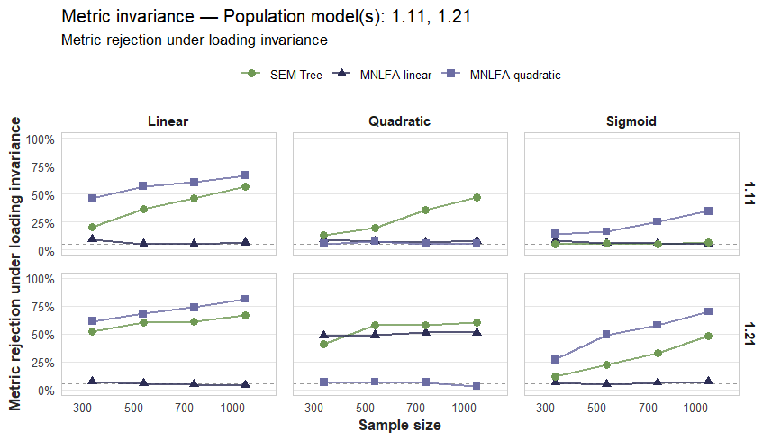

Meaningful comparisons between individuals or groups of individuals depend on the assumption that psychological constructs are measured in the same way across various contexts. 
Unlike weight or height of a person, constructs such as intelligence, attitudes, or personality traits are not directly observable. Instead, researchers infer them from patterns of responses to observed indicators using measurement models. 
Ensuring that these measurements operate equivalently is therefore a prerequisite for valid scientific conclusions.

Recent methodological discussion have highlighted the need for better statistical methods [@Flake2017; @Haig2020; @Altoe2020] as well as more explicit theoretical foundations in psychology [@Eronen2021]. 
Although these discussions often focus on issues of statistical inference or theory construction, both ultimately depend on the quality of measurement. 

As a consequence, neither statistical sophistication nor a strong theoretical framework can compensate for inadequate measurement. 
When a measure fails to represent the intended construct or functions differently across individuals, groups, or contexts, even highly rigorous analyses may produce misleading conclusions [@Flake2020; @Flake2017]. 
Thus, a pivotal aspect of measurement quality is _measurement invariance_ (MI), which refers to the assumption that a measurement model operates equivalently across individuals, groups, contexts, or measurement occasions. 

When MI holds, the relationship between a latent construct and its observed indicators remains stable across the conditions being compared [@Meredith1993]. 
The MI assumption is essential whenever researchers seek to compare latent means, variances, covariances, or structural relations, making MI a fundamental prerequisite for correlational, experimental, and longitudinal research designs [@Putnick2016; @Little1997].  
Violations of MI imply that the relationship between the latent construct and its observed indicators differs across groups or conditions. 
In such cases, differences in observed responses may not solely reflect differences in the underlying construct but may also arise from systematic differences in item functioning or measurement precision. 
Consequently, observed group differences become ambiguous, as they may represent a combination of substantive construct differences and measurement-related distortions [@Cheung2002; @Meredith1993]. 
Without establishing MI, it is therefore impossible to determine whether observed differences reflect true differences in the latent construct or artifacts of the measurement process.
Consequently, MI is not only a methodological requirement but also a prerequisite for valid theoretical interpretation.

## Classical Measurement Invariance Testing 

Structural equation models (SEMs) are widely used to define latent constructs and their relations to observed indicators [@Kline2023; @Bollen2011; @tarka2018]. 
Within SEMs, measurement models specify the relationships between latent factors and their manifest indicators. 
By separating construct-related variance from measurement error, latent variable models provide a principled basis for evaluating measurement quality [@Bollen1989].

Classical approaches to MI testing are fundamentally confirmatory in nature.
Researchers begin by specifying a measurement model, typically in the form of a confirmatory factor analysis (CFA), that reflects substantive hypotheses about the construct under investigation. 
A categorical grouping variable is then used to partition the sample into two or more groups, across which measurement parameters are constrained and compared. 
This most widely used approach for evaluating MI is usually referred to as multiple-group confirmatory factor analysis (MGCFA) [e.g. @Cheung2002; @Putnick2016].  
In MGCFA, MI is typically assessed through a sequence of nested model comparisons in which increasingly restrictive equality constraints are imposed on the model parameters. 
Equality of the models structure in both groups is called _configural invariance_, and can be understood as both groups sharing the same factor structure (i.e., same number of latent factors and same pattern of loadings between factors and items). 
Equality of factor loadings former is referred to as _metric invariance_, if metric invariance is present it indicates that all factor loading parameters are equal across groups. 
Specifically, this suggests that the items of a given scale and their underlying constructs relate to each other with the same strengths in both groups. 
_Scalar invariance_ further constrains item intercepts to equality across groups. 
Establishing scalar invariance is required for meaningful comparisons of latent means because it indicates that the measurement scale has the same unit and origin across groups [@Little1997].
_Residual_ or _strict invariance_ assumes, additionally to the constraints above, that variables residuals are equal across the groups. 
If residual variance holds, the items of the scale are measuring the latent constructs with the same measurement error. 
This implies that it can indeed be known whether differences measured by the items of the tested scale between the groups are due to group differences in the proposed factors or due to measurement errors [@Cheung2002; @Widaman1997]. 
The appropriate level of invariance required depends on the substantive inference of interest. 
For example, scalar invariance is generally required when comparing latent means across groups, whereas less restrictive forms of invariance may be sufficient for research questions about correlations [@Putnick2016]. 

In MGCFA, MI testing depends on the specified measurement model and grouping variable.
Accordingly, measurement noninvariance (MNI) can only be detected with respect to the grouping variables included in the analysis. 
This framework is well suited to settings in which theory implies meaningful discrete distinctions, such as treatment conditions, demographic categories, or measurement occasions.
However, many characteristics that may affect measurement functioning vary continuously across individuals. 
Converting such characteristics into predefined groups may require arbitrary cutoffs and obscure relevant variation in measurement parameters.

<!-- Add an empirical example, for easier understanding, that is used through ot the methods as reference point on how they differ in their understanding and how they deal differently with that example case ( maybe something that also would fit the simulated measurement models) Maybe SHS ? -->

Those limitations of group-based approaches to MI reflect a broader issue concerning the representation of individual differences in psychological research. 
Developmental and lifespan perspectives have long emphasized that psychological processes often vary continuously across individuals rather than occurring in discrete categories. 
In particular, lifespan theories highlight interindividual differences in intraindividual change and conceptualize heterogeneity as a fundamental characteristic of human development [@Baltes1987; @Baltes2007]. 

In line with the argument from @Nesselroade, that understanding psychological processes requires statistical models capable of representing systematic individual differences, heterogeneity is an important source of substantive information in its own right [@Nesselroade1991; @Nesselroade2001].

## Moderated Nonlinear Factor Analysis 

Related arguments have also been made within latent-variable modeling frameworks.  
Consistent with lifespan-developmental perspectives emphasizing individual heterogeneity, @Little1997 argued that substantive psychological questions frequently concern individual differences in developmental and psychological processes and therefore require statistical models capable of representing systematic heterogeneity among individuals. 
Rather than assuming homogeneous relations between latent constructs and observed indicators within broad groups, this perspective encourages the examination of how these relations may vary as a function of individual characteristics [@Little1997]. 
Viewed from this perspective, MNI can be understood as a manifestation of systematic individual differences in the measurement process itself. 
<!-- Maybe we could include this conceptual tie somehow, if this is too far away and would broaden this manuscript too much, we could also again kick it -->
Addressing such heterogeneity requires models in which measurement parameters can vary directly with individual characteristics rather than only across predefined groups. Moderated nonlinear factor analysis (MNLFA) meets this requirement by modeling factor loadings, intercepts, and other measurement parameters as functions of observed covariates, including continuous characteristics [@Bauer2009; @Bauer2017]. In this way, MNLFA extends conventional group-based invariance testing by representing measurement heterogeneity without imposing arbitrary group boundaries.
Then, MNI is conceptualized as moderation of the measurement model itself. 
If measurement parameters differ as a function of the moderator, the measurement model no longer operates equivalently across individuals and therefore violates MI [@Bauer2017; @Kolbe2024].

Whether MI is present depends on which parameters are moderated by exogenous variables. 
The exogenous variables may moderate any subset of the parameters in the measurement model and structural model. 
Specifically, the means, variances, and covariance of latent factors, as well as the item intercepts, factor loadings, and residual variances of any manifest indicator, may vary systematically across individuals as deterministic functions of the exogenous variable [@Bauer2009; @Bauer2017]. 
If moderation is limited to the latent-factor parameters, that is, the means, variances, and covariance, the model remains consistent with MI. 
In contrast, moderation of item-level parameters, including intercepts, loadings, or residual variances, constitutes MNI [@Bauer2017; @Kolbe2024]. 
Accordingly, a moderation function must be specified for each parameter that is allowed to vary as a function of the exogenous variable. 
Because of this conceptualization,this method allows researchers to model gradual, nonlinear, and individual-specific forms of MNI that are difficult to represent within traditional multiple-group approaches [@Bauer2009; @Kolbe2024].

This increased flexibility comes at the cost of greater specification requirements. 
Like MGCFA, MNLFA constitutes a fundamentally confirmatory approach to the assessment of MI [@Bauer2017]. 
In practice, at least three sets of decisions are required. 
First, the measurement model must be specified, including the latent structure and the relationships between latent and observed variables. 
Second, one or more moderator variables must be selected to represent potential sources of heterogeneity in the measurement process. 
Third, moderation functions must be specified for all parameters that are allowed to vary as a function of the moderator. 
This includes determining which parameters are moderated as well as specifying the functional form of each moderation effect (e.g., linear, quadratic, or another parametric form). 
Consequently, the detection of MNI depends not only on the choice of moderator variables but also on the assumptions made about how these moderators influence the model parameters [@Bauer2009; @Bauer2017].
Taken together, MLNFA is a parametric framework for investigating continuous moderators of the measurement model. 
But what could be done to explore types of moderations when we can neither make assumptions about which of the available covariates moderate the measurement model parameters nor what functional form may be appropriate? 

## Structural Equation Model Trees

Structural Equation Model trees (SEM trees) were originally introduced by Brandmaier et al. (2013) as a method for identifying important covariates  and their interactions within SEMs to explain heterogeneity, e.g., by identifying moderators of model parameters in a SEM. 
Subsequent developments further refined the methodology and expanded its applicability (Arnold et al., 2021; Brandmaier et al., 2016). 
Notably, although MI was used as an illustrative application by Arnold et al. (2021), SEM Trees were not originally developed as a dedicated method for testing MI and have received relatively little attention as tools for detecting MNI. 
Because violations of MI manifest as systematic heterogeneity in measurement parameters, SEM trees appear conceptually well suited for detecting such effects.

SEM trees merge two paradigms: SEMs and on decision trees. 
Decision trees describe recursive partitions of the covariate space, whereby the sample is repeatedly split according to covariate values into progressively more homogeneous subsets, in order to maximize differences in a given outcome variable.
SEM Trees combine the hierarchical structure of decision trees with SEMs, so that they describe heterogeneity in data with respect to a specified SEM as targeted outcome structure. 
Unlike many other tree-based methods, SEM Trees can be applied to models that include latent variables. 


In contrast to MGCFA and MNLFA, SEM trees represent a more exploratory approach to the assessment of MI. 
Similar to these methods, SEM trees require the researcher to specify a measurement model a priori.
Beyond this, however, the researcher only needs to provide a set of candidate variables that may account for heterogeneity in the data. 
These variables may be numerous and can be either categorical or continuous. .  
Similar to MGCFA, researchers first specify a measurement model and identify variables that may account for heterogeneity. 
The crucial difference is that MGCFA requires the researcher to select a specific grouping variable and define its functional relationship as moderator in advance, whereas SEM trees can evaluate a large set of candidate variables simultaneously and determine which, if any, are associated with violations of MI. 
Moreover, SEM trees are able to identify nonlinear forms of moderation and data-driven partition points for continuous variables without requiring these relationships to be specified a priori.

SEM trees combine a theory-driven measurement model with a data-driven search for heterogeneity. This makes them especially valuable when researchers have a well-established measurement model but little prior knowledge about where measurement noninvariance may arise or what form it may take. At the same time, the approach remains closely aligned with familiar MGCFA practice, making SEM trees a comparatively accessible extension of conventional MI analysis.

At the same time, SEM trees offer substantially greater flexibility by accommodating multiple candidate moderators, continuous and categorical partitioning variables, and potentially nonlinear forms of heterogeneity -- given that the sample size is large enough to detect such effects. 
Although explicit specification of moderators and moderation functions remains advantageous when strong theoretical expectations are available, SEM trees provide a complementary strategy for situations in which the sources or functional forms of heterogeneity are uncertain. 

## Present Study 

More generally, MGCFA, MNLFA, and SEM trees can be understood as reflecting different assumptions regarding prior knowledge about measurement heterogeneity. 
MGCFA assumes that relevant sources of heterogeneity can be represented through predefined groups. 
MNLFA further assumes that researchers can identify relevant moderators and specify how these moderators influence model parameters. 
SEM trees, in contrast, place fewer assumptions on the structure of heterogeneity and instead emphasize data-driven identification of parameter differences. 
Consequently, the relative performance of these approaches is likely to depend on the extent to which researchers possess accurate prior knowledge about the sources and functional forms of MNI.

The present simulation study compares the performance of MNLFA and SEM trees in detecting MNI across a range of conditions that vary in sample size, effect magnitude, and the location and functional form of moderation.
To reflect both the methodological capabilities of the investigated approaches and plausible empirical scenarios, the simulation incorporates different functional forms of MNI, including linear, quadratic, and sigmoid moderation processes. 
We expect SEM trees to perform particularly well in conditions characterized by nonlinear moderation, especially sigmoid relationships, whereas their relative advantage should diminish in purely linear settings. 
In contrast, MNLFA is expected to perform best when the functional form of moderation is correctly specified, particularly in linear conditions, but to be more sensitive to misspecification of the underlying moderation function. 
For both methods, stronger moderation effects are expected to increase the detectability of measurement non-invariance. 

To enhance the study's relevance for empirical practice, the simulation is grounded in a realistic applied-research perspective. 
Specifically, we consider researchers whose experience with MI testing is rooted in the traditional MGCFA framework and who seek to adopt more flexible approaches for detecting heterogeneity. 
Accordingly, MNLFA and SEM trees are evaluated not only as statistical procedures but also as methodological alternatives for researchers moving beyond conventional MGCFA-based invariance testing.  
That is, there are several alternative methods that share some of the advantages highlighted above, a few of which we also want to mention. 

Related tree-based approaches have recently been developed, building directly on the SEM tree framework, specifically for investigating MNI across multiple covariates. 
@Sterner2023 introduced exploratory factor analysis (EFA) trees as an extension of SEM trees, and @Goretzko2026 subsequently extended this approach to CFA trees. 
Like SEM trees, EFA and CFA trees use model-based recursive partitioning and score-based structural-change tests to identify parameter instability across candidate covariates. 
Their principal extension concerns the measurement model to which recursive partitioning is applied: EFA trees integrate an exploratory factor model, facilitating the investigation of MNI during early stages of measurement development, whereas CFA trees incorporate a constrained factor model and thereby allow MNI to be investigated when a hypothesized measurement structure is already available (@Sterner2023; @Goretzko2026). 
Thus, SEM trees constitute the more general framework from which these approaches developed and can be applied to parameter heterogeneity in structural equation models beyond factor-analytic models and MI (@Brandmaier2013; @Arnold2021). 
In the present study, we apply this general SEM tree framework specifically to MI by focusing score-based instability tests on factor loadings and item intercepts, corresponding to metric and scalar MNI, respectively. 
Thus, rather than proposing a dedicated tree-based MI procedure, we investigate the performance of the general SEM tree framework for detecting MNI and compare it with the parametric moderation approach of MNLFA.

It is to be noted that regularization provides an additional extension to several of these approaches and may be particularly useful when complex measurement models or large numbers of potential sources of MNI are considered. 
Within EFA, regularization can be used to obtain sparse and interpretable loading structures without relying on conventional factor rotation (@Goretzko2025), whereas within MNLFA, regularization has been applied to moderation parameters to identify measurement bias across multiple categorical and continuous background characteristics (@Bauer2020; @Belzak2024). 
Although such extensions can reduce the need to prespecify individual sources of measurement heterogeneity, they also introduce additional methodological choices concerning penalization and model selection. 
The present study therefore focuses on MNLFA and SEM trees without regularization. 
This choice reflects our aim to compare approaches that constitute relatively direct extensions of conventional MGCFA for applied researchers with an established measurement model, while differing in the assumptions they require about potential moderators and the functional form of MNI.

## Application Example 

We want to show the different approaches performance on an illustrative empirical example. 
For that we chose to explore the MI of the CASP-12 scale regarding age, gender and cultural background as well as additional covariates from the ninth wave of the Survey of Health, Ageing and Retirement in Europe study (SHARE) [@SHAREwave9]. 
The CASP scale was originally designed to evaluate older peoples quality of life. 
The CASP-12 is a shorter version of the original 19 item version of the casp scale. 
Additionally the shorter CASP-12 version, suggested by @wiggins2008 is also slightly different from the version used in the SHARE assessment [@BorratBesson2015; @wiggins2008].
<!-- Exact study for SHARE version here -->

@BonnevilleRoussy2024 investigated the MI of the CASP-12 scale and its four-factor structure (i.e. Control, Autonomy, Self-Realization, Pleasure), used in the SHARE data with respect to longitudinal invariance, culture, age and gender.

### Age 
@BonnevilleRoussy2024 looked at the CASP-12’s age invariance over time across four age groups: under 60, 60–69, 70–79, 80 and older. 

### Gender 
Gender is assessed by SHARE at the first time of measurement with a coding of 0 for males and 1 for females.

### Culture 
Cultural invariance was tested between "Western", "Northern", "Southern" and "Eastern Europe".

This highlights the implicit need for categorization, when using MGCFA to test for MI. 
We want to use this as a possible example case to use these methods for MI testing, that allow for the variables to be included as continuous variables, possibly avoiding arbitrary categorization. 
@BonnevilleRoussy2024 investigated the longitudinal as well as the cross-sectional MI. 
For this empirical example we will investigate only the cross-sectional MI of the CASP-12 scale in the ninth wave, with age, gender and culture as covariates. 

# Method

## Simulation 

## Data-generating mechanism 

Data were generated from a single-factor CFA model measured by four continuous indicators. 
Baseline factor loadings were fixed to

$$
\lambda = 0.70,
$$

baseline intercepts were fixed to one, and the latent factor variance was fixed to one. 

Residual variances were fixed such that indicator reliability equaled $\rho = .75.$ at the baseline factor loading of $\lambda=.70$. 
Because residual variances were held constant while loadings varied under loading moderation, conditional indicator reliability varied accordingly in conditions with metric noninvariance. 
MNI was introduced by allowing selected factor loadings and/or item intercepts to depend on the moderator.

Nine population models were investigated.

| Model | Loading moderation | Intercept moderation |
|-------|--------------------|----------------------|
|0|none|none|
|1.1|all items|none|
|1.11|none|all items|
|1.12|all items|all items|
|1.2|items 1--2|none|
|1.21|none|items 1--2|
|1.22|items 1--2|items 1--2|
|1.3|all items; interaction term|none|
|1.32|loading moderation by one moderator; intercept moderation by a second moderator|


MNI was generated by allowing selected measurement parameters to vary continuously as deterministic functions of an observed moderator variable. 
For each simulated individual, a moderator

$$
M \sim \mathcal U(-1,1)
$$

was sampled from a continuous uniform distribution and transformed into an effective moderator

$$
Z = h(M),
$$

where the transformation $h(\cdot)$ determined the functional form of moderation. 
Measurement parameters were subsequently modeled as linear functions of the transformed moderator. 
Consequently, any nonlinearity in parameter variation arose exclusively through the transformation $h(\cdot)$.

### Functional forms of moderation

Four moderator functions were considered:

1. **Linear:**
   $$
   h(M) = M
   $$
   
In this case, the effective moderator is bounded to the interval $(-1,1)$ and rotation symmetric around zero.

2. **Sigmoid:**
   $$
   h(M) = a + \frac{b-a}{1 + \exp\!\bigl(-k(M-c)\bigr)},
   \qquad a=-1,\; b=1,\; c=0,\; k>0.
   $$
This transformation maps the input to the open interval $(-1, 1)$ and yields a bounded moderator, rotation symmetric around zero, exhibiting diminishing sensitivity at extreme values.

3. **Quadratic:**
   $$
   h(M) = 2M^2 - 1
   $$
This transformation captures symmetric nonlinear moderation as a function of distance from the center while remaining bounded in $(-1,1)$.

4. **Noise:**
   $$
   h(M) = 0
   $$

These functions were selected to represent qualitatively different forms of heterogeneity. 
The first three functions represented structured forms of moderation, whereas the noise condition represented the absence of systematic moderation. 
All moderator transformations were bounded to the interval $(-1,1)$, implying identical maximum parameter deviations for a given moderation coefficient, but not necessarily the same variance.
Consequently, identical values of the moderation coefficient imply identical maximum parameter deviations but not necessarily identical average parameter variation.

```{r}
#| echo: false
#| warning: false
#| message: false
#| fig-align: center
#| out-width: "75%"

library(ggplot2)
library(dplyr)
library(tidyr)

M <- seq(-1, 1, length.out = 500)
k <- 10

df_h <- tibble(
  M = M,
  Linear = M,
  Quadratic = 2 * M^2 - 1,
  Sigmoid = -1 + 2 / (1 + exp(-k * M)),
  Noise = 0
) |>
  pivot_longer(
    cols = -M,
    names_to = "Function",
    values_to = "hM"
  )

ggplot(df_h, aes(x = M, y = hM, color = Function, linetype = Function)) +
  geom_line(linewidth = 1) +
  labs(
    x = "Moderator M",
    y = "h(M)",
    color = "Function",
    linetype = NULL
  ) +
  theme_minimal(base_size = 16) +
  theme(
    legend.position = "none",
    panel.grid.minor = element_blank()
  )
```

## Simulation design

The simulation crossed data-generating conditions with analysis method. 
Data-generating conditions manipulated

- population model,
- functional form of moderation (linear, quadratic, sigmoid, null),
- loading moderation magnitude

$$
\delta_\lambda \in \{0.20,0.30\},
$$

- intercept moderation magnitude

$$
\delta_\nu \in \{0.50,1.00\},
$$

- sample size

$$
N\in\{300,500,700,1000\}.
$$
Each generated dataset was subsequently analyzed using three methods: linear MNLFA, quadratic MNLFA, and SEM Trees. 
The resulting factorial design consisted of 576 factorial design cells, each of which was analyzed using three analysis methods.

## Analysis models

Each simulated dataset was analyzed using both MNLFA (i.e. either 'linear MNLFA' or 'quadratic MNLFA') and score-based SEM Trees.

Two MNLFA specifications were considered. 
In the linear MNLFA analysis, moderation was modeled as a linear function of the transformed moderator, which we consider the default use case of MLNFA. 
In the quadratic MNLFA analysis, moderation was modeled using the quadratically transformed moderator, assuming that a researcher expected a quadratic effect of the moderator. <!-- add more specific formulation here? -->
Thus, the analytical model was correctly specified whenever the assumed moderator transformation matched the data-generating process and misspecified otherwise.

For SEM trees, the same basic measurement model was estimated using recursive partitioning. 
To ensure a fair comparison with MNLFA, SEM trees were supplied only with the true moderator variables. 
Consequently, differences between both methods reflect differences in how moderation is modeled/handled rather than differences in the available information.

In an additional robustness analysis, the true moderator was supplemented with ten independent noise predictors. 
This condition was included to investigate the ability of SEM Trees to distinguish informative moderators from irrelevant covariates when multiple candidate splitting variables are available.

## Evaluation criteria

Performance was evaluated separately for metric and scalar MNI. 
For MNLFA, metric and scalar MNI were assessed using sequential likelihood-ratio tests comparing nested moderation models. 
For SEM trees, MNI was assessed using score-based global parameter-instability tests on the respective focus parameters (factor loadings or intercepts) with Bonferroni-adjusted significance tests.
[TODO: AB->LH: Zitationen zu den score-based Tests, Arnold und Zeileis einfügen]
For each population model and simulation condition, the following performance measures were computed:

- **Statistical power:** The proportion of simulation replications in which the method rejected the null hypothesis of MI at the corresponding level when the respective form of MNI was present in the data-generating model.

- **Rejection rate:** The proportion of simulation replications in which the method rejected the null hypothesis of MI at the corresponding level when that form of MNI was absent in the data-generating model.

In the primary comparison, SEM trees were supplied only with the true moderator variables. 
Consequently, statistical power and rejection rates reflect the ability to detect MNI independent of moderator selection.

In an additional robustness analysis, the true moderator was supplemented with ten independent noise predictors. 
For this condition, statistical power was defined as

$$
P(\text{reject parameter stability} \;\cap\; \text{select true moderator}
\mid \text{the corresponding form of MNI is present}),
$$

such that a simulation replication counted as successful only if the tree both rejected the null hypothesis of parameter stability and selected the true moderator as a splitting variable. 
This criterion therefore jointly evaluates the ability of SEM trees to detect MNI and to distinguish informative moderators from irrelevant candidate predictors.

## Replications

Each data-generating design cell was replicated 100 times. 
Every generated dataset was analyzed using all three analysis methods, resulting in 1,728 method-specific analysis cells. 
An additional 100 SEM tree analyses were conducted for the noisy-predictor sensitivity condition. <!-- exact number -->

## Empirical Example 

The CASP-12 scale [@] comprises 12 items and assesses four domains of quality of life: Control, Autonomy, Self-Realization and Pleasure. 
Each factor is assessed using three items. 
Responses are rated on a four-point rating scale ranging from 1 (Often) to 4 (Never), with some items requiring inverse scoring before calculation of the total score. 
Higher CASP-12 scores indicate better quality of life. 
Age as covariate is included continuously, gender is included as dichotomous variable and culture is <!-- complete depending on how its assessed in SHARE - countries? -->
All covariates are included simultaneously in the analytical model. 


## Software

All simulations were conducted in R [@Rteam2025]. 
MNLFA models were estimated using `OpenMx` [@Boker2026] with raw-data maximum likelihood and definition variables. 
Score-based SEM trees were estimated using the `semtree` package [@Arnold2021]. [TODO: AB->LH: Es gibt eine eigene Package citation!]
Simulation design construction, data handling, aggregation, and visualization will rely on `dplyr`[@dplyr2026], `tidyr` [@tidyr2025], `tibble` [@tibble2026], `purrr` [@purrr2026], `future` [@future2021], `parallel` [@Rteam2025], and `ggplot2` [@ggplot2016].

# Results 

## Simulation 

Across 172,800 method-specific simulation runs, 42 (0.024%) did not yield evaluable metric or scalar test results. 
This occurred in 11 of 57,600 MNLFA runs (0.019%) and 31 of 57,600 MNLFAQ runs (0.054%); all 57,600 SEM tree runs yielded evaluable test results. 
Whenever results were unavailable, both metric and scalar test results were missing. 
Rejection rates were calculated based on the number of evaluable replications within each condition, with all conditions comprising 100 attempted replications.

Table 2 summarizes metric and scalar rejection rates across population models.

```{r table2, eval=TRUE, echo=FALSE, warning=FALSE, message=FALSE, results='asis'}
library(knitr) 
load("manuscript_tables.RData")
cat("\\begin{table}[H]\n")
cat("\\centering\n")

cat(
  knitr::kable(
    table2_print,
    format = "latex",
    booktabs = TRUE,
    align = c("l", "l", "l", "c", "c"),
    caption = NULL
  )
)

cat("\\caption{Rejection rates for metric and scalar measurement invariance across population models. Monte Carlo standard errors are given in parentheses.}\n")
cat("\\end{table}\n")
```

Under complete MI (Model 0), rejection rates were generally close to the nominal \(\alpha=.05\) level. 
For metric invariance, average rejection rates were .063 for linear MNLFA, .067 for quadratic MNLFA, and .050 for SEM trees. 
Corresponding scalar rejection rates were .052, .053, and .044, respectively (see table 2). 
Rejection rates were relatively stable across sample sizes and functional forms.

```{r table3, eval=TRUE, warning=FALSE, message=FALSE, echo=FALSE, results='asis'}
cat("\\begin{table}[H]\n")
cat("\\centering\n")

cat(
  knitr::kable(
    table3,
    format = "latex",
    booktabs = TRUE,
    align = c("l", "l", "l", "c", "c", "c"),
    caption = NULL
  )
)

cat("\\caption{Power and rejection rates under invariance by moderator functional form. Monte Carlo standard errors are given in parentheses.}\n")
cat("\\end{table}\n")
```

As shown in Table 3, statistical power depended strongly on the correspondence between the functional form of MNI and the moderator specification used in MNLFA.
For metric MNI, linear MNLFA achieved high power under linear (.970) and sigmoid (.997) moderation and substantially lower power under quadratic moderation (.166). 
The complementary pattern occurred for quadratic MNLFA, which showed high power under quadratic moderation (.978) but considerably lower power under linear (.407) and sigmoid (.258) moderation. 
SEM tree power was comparatively stable across functional forms, ranging from .903 to .934. 
The same pattern was more pronounced for scalar MNI: linear MNLFA showed essentially complete power under linear and sigmoid moderation but low power under quadratic moderation (.089), whereas quadratic MNLFA achieved complete power under quadratic moderation but little power under linear (.066) or sigmoid (.054) moderation. 
SEM tree scalar power remained at or above .992 across all three functional forms.

Power generally increased with sample size, particularly for SEM trees, which often approached ceiling performance by $N=700$ or $N=1000$. 
In contrast, increasing sample size did not compensate for functional-form mismatch in MNLFA. 
The linear specification remained weak under quadratic MNI even at larger sample sizes, whereas the quadratic specification remained weak under linear and sigmoid MNI. 
Beyond functional form and sample size, power also varied somewhat across MNI configurations. 
SEM tree metric power was consistently high across most population models but was comparatively lower for Model 1.32 (.769), in which loading and intercept noninvariance were induced by different moderators. 
Thus, although SEM trees were generally robust across functional forms, their performance was not entirely independent of the specific configuration of MNI.

When loadings were invariant but intercept MNI was present, metric rejection rates were sometimes substantially above .05, indicating cross-level sensitivity rather than complete-null Type I error. 
This was particularly evident for SEM trees and for the functionally mismatched MNLFA specification. 
For example, under linear moderation, metric rejection under loading invariance averaged .058 for linear MNLFA, compared with .453 for quadratic MNLFA and .350 for SEM trees. 
Thus, high sensitivity of the SEM tree metric test was accompanied by reduced specificity for the level of noninvariance when scalar MNI was present. 
In contrast, scalar rejection rates when intercepts were invariant remained generally close to the nominal level across methods and functional forms, indicating considerably less cross-level rejection of scalar tests in the presence of loading MNI.

```{r, echo=FALSE, out.width="80%", fig.align="center"}

```

The elevated metric rejection rates in the presence of scalar MNI also varied with sample size (Figure X). In several conditions, particularly for SEM trees, metric rejection increased as sample size increased, indicating that the cross-level sensitivity became more pronounced with increasing statistical information.

```{r table4, eval=TRUE, warning=FALSE, message=FALSE, echo=FALSE, results='asis'}
cat("\\begin{table}[H]\n")
cat("\\centering\n")
cat("\\resizebox{\\textwidth}{!}{%\n")

cat(
  knitr::kable(
    table4_print,
    format = "latex",
    booktabs = TRUE,
    digits = 3,
    caption = NULL
  )
)

cat("}\n")
cat("\\caption{Sequential classification outcomes by true measurement-invariance condition and method.}\n")
cat("\\end{table}\n")
```

Sequential testing altered the interpretation of the level-specific results. 
SEM trees showed the highest correct classification for metric-only MNI (.959) and combined metric and scalar MNI (.884), compared with .699 and .723 for linear MNLFA and .418 and .678 for quadratic MNLFA, respectively. 
However, performance differed for scalar-only MNI (see table 4). 
Although the separate SEM tree scalar test showed near-perfect power, the sequential procedure correctly classified scalar-only MNI in only .635 of replications because the metric test rejected first in .362 of replications. 
Linear MNLFA showed similar sequential accuracy for scalar-only MNI (.645), whereas quadratic MNLFA was lower (.332) (see table 4).

## Empirical Example 

### MNLFA
The MNLFA provided evidence against both metric and scalar MI of the CASP-12. 
Constraining loading moderation to zero resulted in a significant deterioration in model fit relative to the unrestricted model $(\Delta\chi^2(40)=2524.64; p<.001)$. 
Additional constraints on intercept moderation also resulted in a significant deterioration in fit, $(\Delta\chi^2(40)=13541.93; p<.001)$ (Table X). <!-- unsure if table here --> 
Thus, the MNLFA indicated moderation of both factor loadings and item intercepts.

The estimated moderation coefficients suggested that MNI was primarily associated with age and cultural cluster, whereas gender-related differences were comparatively small (Tables X and X). <!-- unsure if tables here --> 
Loading moderation was particularly pronounced for the Autonomy items. <!-- in line with BonnevilleRoussy2024-->
For example, the largest loading-moderation coefficients for Southern Europe relative to the Western European reference group were observed for A3 $(\hat\beta=.423)$ and C3 $(\hat\beta=.358)$, while the corresponding coefficients for Eastern Europe were largest for A3 $(\hat\beta=.345)$ and A2 $(\hat\beta=.297)$. 
Age-related loading moderation was smaller in magnitude, with the largest coefficients observed for A3 $(\hat\beta=-.098)$ and A2 $(\hat\beta=-.084)$. 
Gender-related loading-moderation coefficients were small throughout.

Differences were more pronounced for item intercepts. 
The largest coefficients were observed for the Southern European cluster, particularly for A3 $(\hat\beta=-1.569)$ and A2 $(\hat\beta=-1.220)$, followed by the Eastern European cluster for A3 $(\hat\beta=-1.247)$ and A2 $(\hat\beta=-.701)$. 
Age was also associated with substantial intercept moderation for A3 $(\hat\beta=.621)$ and A2 $(\hat\beta=.503)$. 
Nordic membership was most strongly associated with intercept differences for the Pleasure items P3 $(\hat\beta=.587)$ and P2 $(\hat\beta=.487)$. 
In contrast, gender-related intercept-moderation coefficients were again comparatively small.

### SEM trees 
<!-- LH TODO: Rerun tree analysis because exclusion of two ages with value -1 -->
The baseline four-factor model used for the SEM tree analyses converged successfully ($N=65{,}215$, 42 free parameters, $-2LL=1{,}801{,}399, AIC =1{,}801{,}483, BIC =1{,}801{,}864$)$. 
The score-guided SEM tree analyses also indicated parameter instability at both the metric and scalar levels ($p<.001$ for both tests).

For metric invariance, cultural cluster was selected as the first partitioning variable by the trees, separating Western and Nordic countries from Southern and Eastern countries $(LR=5988.70; df=8)$. 
Within both resulting branches, the next partition was based on age, at approximately 69 years. 
Further age-based partitions occurred at approximately 65 and 79 years, together with an additional distinction between Western and Nordic countries within one subgroup. 
 <!-- LH TODO: Include tree plot here -->
Thus, the metric tree indicated that loading differences were primarily structured by cultural cluster and age. Gender was not selected as a partitioning variable.

For scalar invariance, age was selected as the first partitioning variable, with the initial split occurring at approximately 79 years.
Cultural cluster was subsequently selected in both age-defined branches, consistently distinguishing Southern Europe from the remaining cultural clusters. 
Further partitions were again based on age, with additional cutoffs around 69 years among younger participants and around 87–88 years among older participants. 
Gender was not selected as a partitioning variable.
The scalar tree therefore indicated a combination of age- and culture-related intercept instability, with Southern Europe emerging repeatedly as a distinct subgroup.

# Discussion 

The simulation results revealed a trade-off between model-based specificity and data-driven flexibility in detecting MNI. 
MNLFA achieved high power when the specified moderator function corresponded to the functional form of the underlying MNI, but performance deteriorated substantially under functional-form misspecification. 
In particular, linear MNLFA performed well for linear and sigmoid effects but poorly for quadratic effects, whereas the quadratic specification showed the complementary pattern.
The strong performance of linear MNLFA under sigmoid moderation should, however, be interpreted in light of the specific moderator range and steepness used in the data-generating model. 
Within the simulated range, a substantial portion of the sigmoid relationship was approximately linear, allowing the linear specification to capture much of the induced moderation. 
Consequently, these findings should not be interpreted as indicating that linear MNLFA is generally robust to nonlinear sigmoid effects; performance is likely to depend on the degree of nonlinearity expressed over the observed moderator range.
Increasing sample size improved power when the moderator specification was appropriate but did not compensate for functional-form mismatch. 
SEM trees, in contrast, showed consistently high power across linear, quadratic, and sigmoid forms, demonstrating greater robustness when the functional form of MNI was not known in advance. 
However, although SEM trees showed good calibration under complete MI, metric tests exhibited elevated rejection rates in conditions in which loadings were invariant but intercepts were noninvariant, indicating reduced specificity for distinguishing the level at which MNI occurred. 
This issue was particularly consequential under sequential testing, where metric rejection could prevent scalar-only MNI from being correctly classified. 
Overall, the simulations suggest that MNLFA can provide highly sensitive detection when the moderator effect is appropriately specified, whereas SEM trees offer greater protection against functional-form misspecification but may be less precise in localizing MNI to the metric versus scalar level.

The empirical application illustrated both the convergence and the complementary information provided by MNLFA and SEM trees. 
Both approaches indicated metric and scalar MNI in the CASP-12 and identified age and cultural cluster as more prominent sources of parameter instability than gender. 
MNLFA characterized these differences through moderator-specific changes in individual loadings and intercepts, with the largest estimated effects occurring primarily for cultural cluster and age and particularly for the Autonomy items. 
SEM trees identified a corresponding but more explicitly subgroup-based pattern: cultural cluster provided the primary partition for loading instability, whereas age provided the primary partition for intercept instability, with subsequent splits revealing conditional combinations of age and cultural cluster.

<!-- General Discussion 
Comparison of findings across studies.
What generalized across population models.
Where results diverged.
Practical recommendations.

- Sequential testing altered the interpretation of the level-specific results, although the underlying scalar tests differed between approaches as specified above.

- Distinction to CFA trees and EFA trees!

-->


## Practical Recommendations 

<!-- Use MNLFA when... ; Use SEM trees when ... -->

# References
